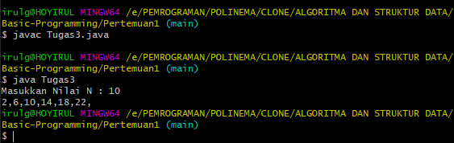

# Tugas Pertemuan 1 ALgoritma dan Struktur Data

## Tugas nomor 1
### SMILELAUNDRY (pendapatan)
output program :
menyertakan gambar

## Tugas nomor 2
### Menghitung sukubunga dan di bulan keberapakan tabungan mencapai 1.500.000
output program :
menyertakan gambar

## Tugas nomor 3
### Deret bilangan genap kecuali bilangan kelipatan 4
output program :
menyertakan gambar

## Tugas nomor 4
### Menghitung Luas Segitiga, Persegi Panjang dan Lingkaran menggunakan fungsi
output program :
menyertakan gambar
