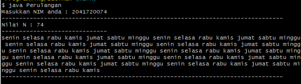
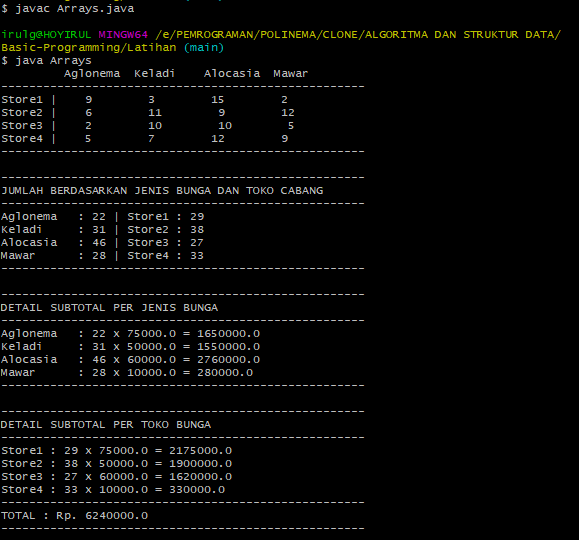
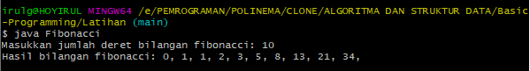

# Latihan ALgoritma dan Struktur Data

## PEMILIHAN
### Menghitung nilai akhir mahasiswa
output program :
menyertakan gambar

## Perulangan
### Mengulang hari berdasaran 2 digit angka nim(paling belakang)
output program :
menyertakan gambar

## Array
### Menghitung pendapatan toko bunga
output program :
menyertakan gambar

## Fungsi (Rekursif)
### Bilangan fibonacci
output program :
menyertakan gambar
