# Laporan Pertemuan 10

## Pertanyaan 8.2.3
1. Karena array dimulai dari nol. -1 di anggap tidak ada datanya (Kosong)
2. jika rear sudah sama dengan max-1 maka rear akan menjadi 0
3. Gambar
    - 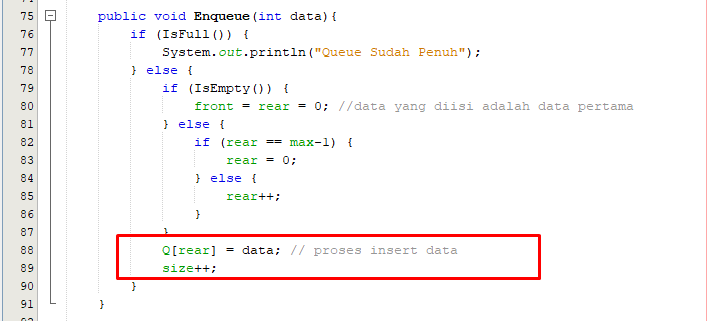
3. Gambar
    - 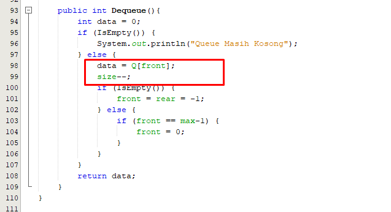

## Pertanyaan 7.3.3
1. Data dari instansiasi class Buku -> (judul, nama, tahun, jml, hrg)
2. Screenshot
    - 
3. fungsi dari do-while pada StackMain adalah untuk looping isi data dari buku, jika ingin menambahkan tekan [Y/y] atau [N/n] jika tidak
4. Screenshot
    - 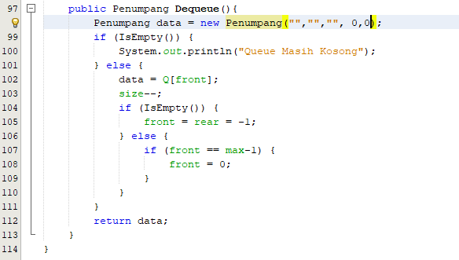
    - 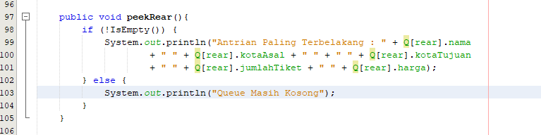
5. pada kode tersebut bahwa jika front == max-1 maka front akan = 0
6. karena i akan mengeksekusi posisi front bedara dimana jika front di index ke 2 maka otomatis i = 2
7. pada kode tersebut bahwa nilai i akan di tambahkan 1 dan di modulus max

## Pertanyaan 8.3.3
1. Fungsi dari kode tersebut adalah instansiasi data dan untuk mengambil data antrian
2. Error karena di class Penumpang bahwa constuktor Penumpang mempunyai parameter jika tidak ada para meternya maka akan error
3. Screenshot
    - 
4. Screenshot
    - 
    - 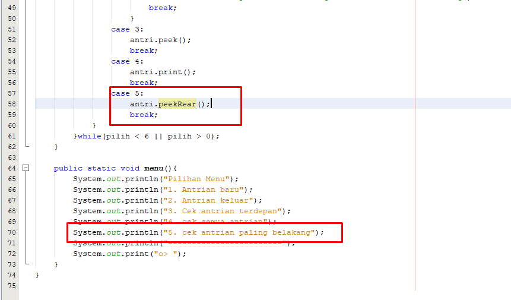

## 8.4 TUGAS
1. Code
    * 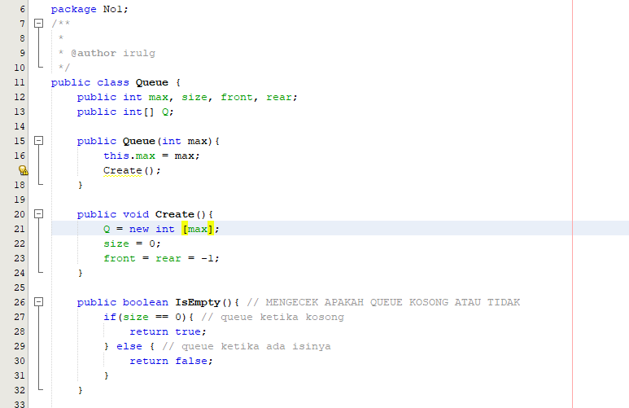
    * 
    * 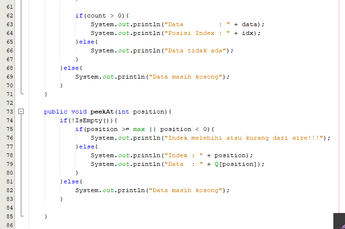
    * 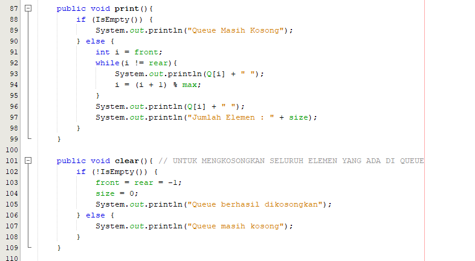
    * 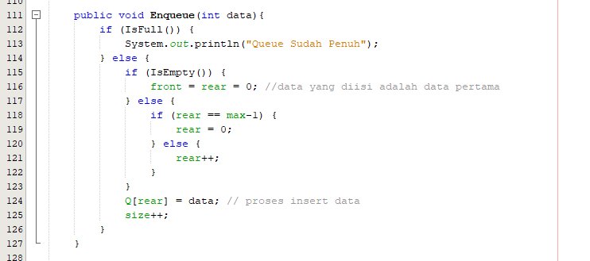
    * 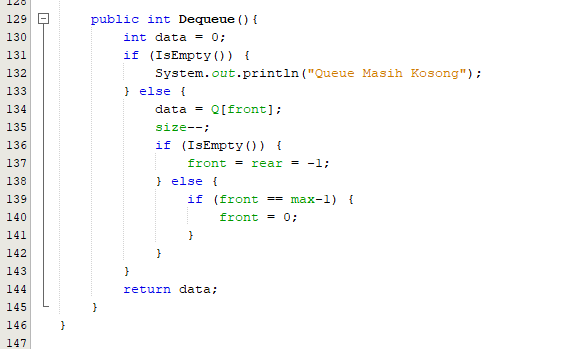
    * 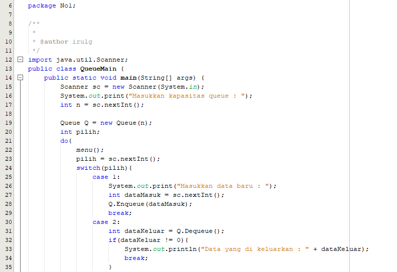
    * 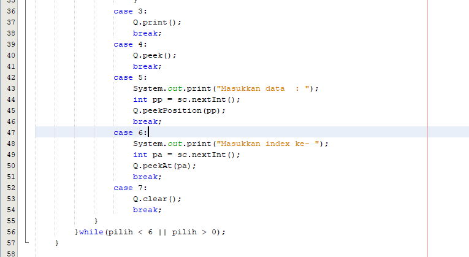
    * 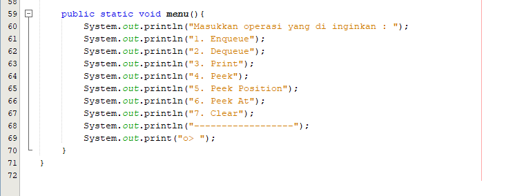
   Output
    * 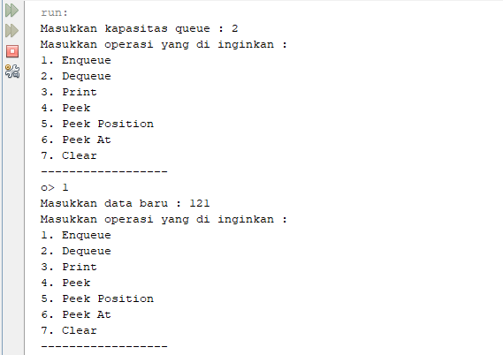
    * 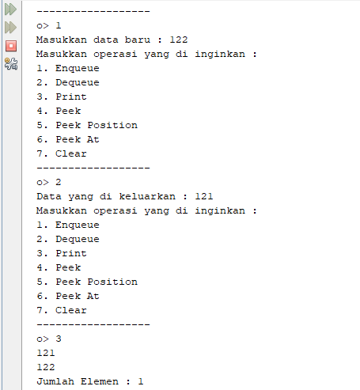
    * 
    * 
2. Code
    * 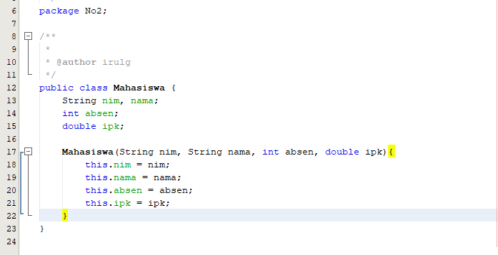
    * 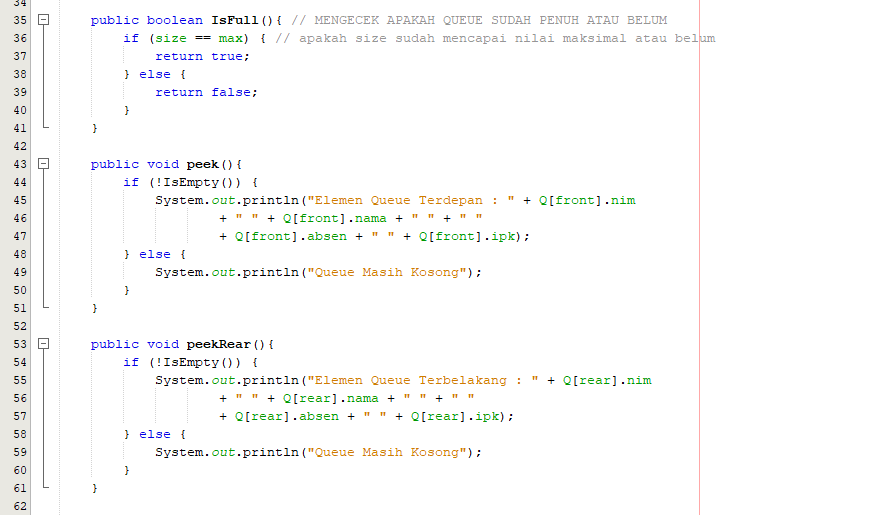
    * 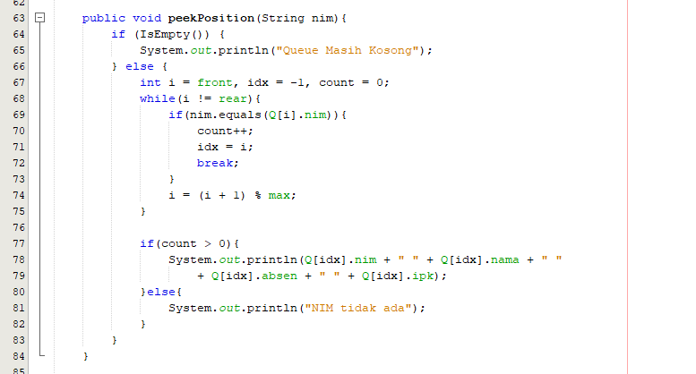
    * 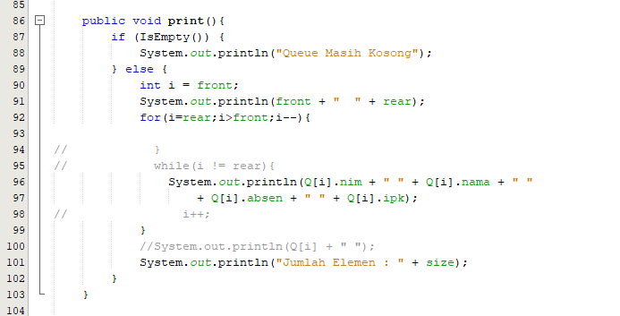
    * 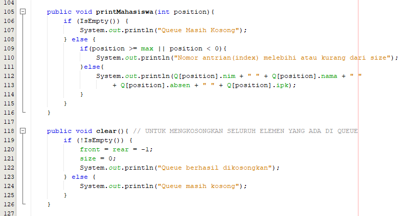
    * 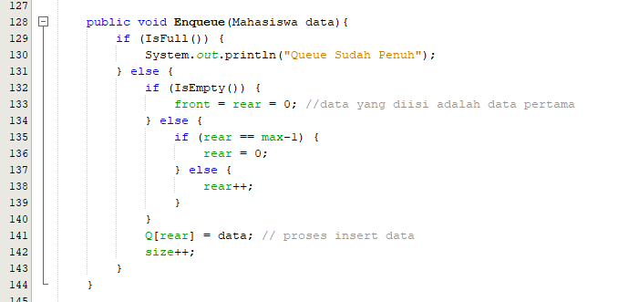
    * 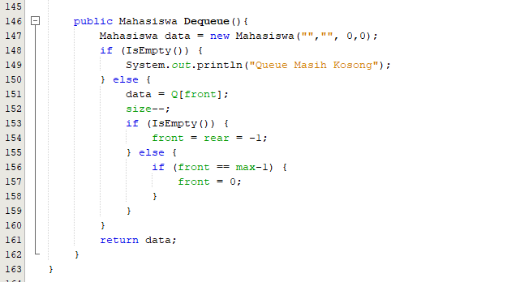
    * 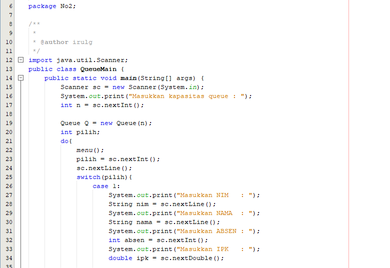
    * 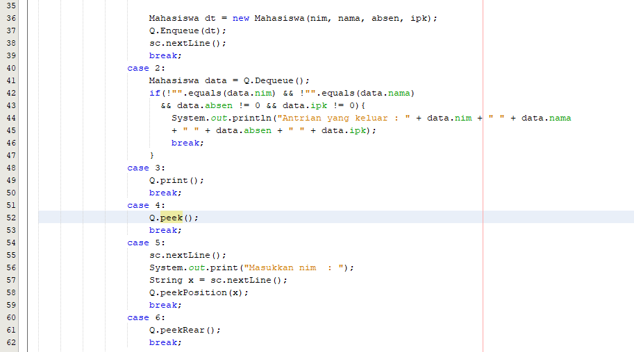
    * 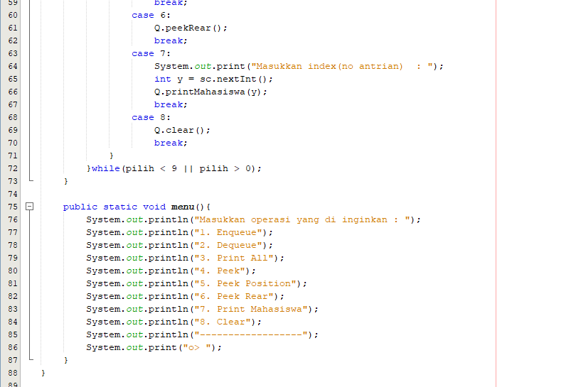
   Output
    * 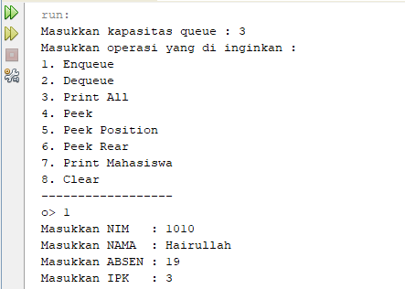
    * 
    * 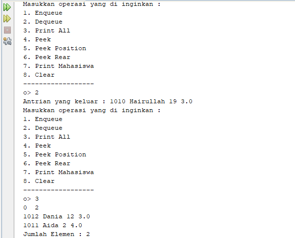
    * 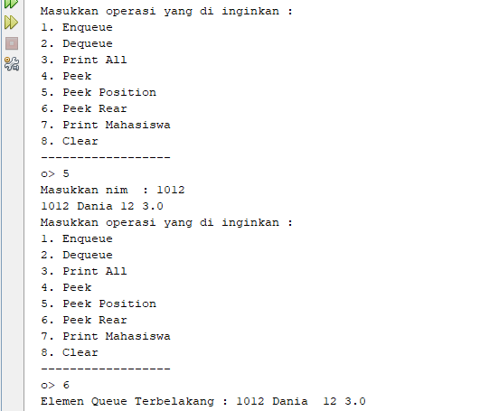
    * 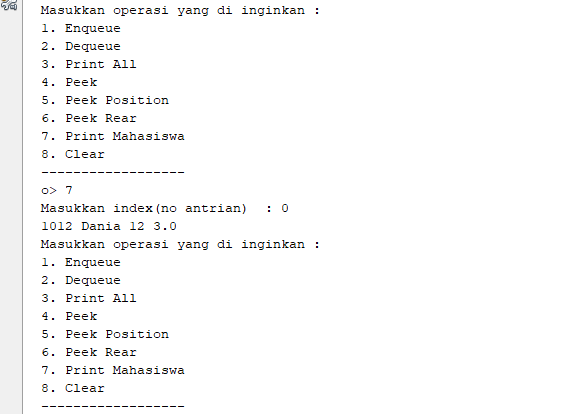