## LAPORAN PERTEMUAN 14

### 13.2.2 Pertanyaan Percobaan
1. Karena data pada Binary Search Tree (BST) terlebih dahulu diurutkan oleh karena itu pencarian data akan lebih mudah
2. Sebagai petunjuk leftchild dan right child
3. * A. Sebagai pendeklarasian sebab akar dari tree
   * B. null
4. Proses akan dilakukan pada method add()
5. Apabila data akan diinputkan lebih kecil dari data yang sekarang dan apabila data sebelah kiri pada data yang sekarang tidak sama dengan null maka data yang sekarang akan bergeser ke sebelah kiri dari data yang sekarang. Tetapi ketika data sebelah kiri dari data saat ini sama dengan null maka data baru akan menempati bagian kiri dari data saat ini dan proses akan berhenti

### 13.3.2 Pertanyaan Percobaan
1.  * Atribut data 	: sebagai penyimpan elemen nilai
    * Atribut idxLast	: sebagai penyimpan nilai dari indeks terakhir yang akan ditampilkan
2. Sebagai konstruktor berparameter
3. untuk mencetak data dari subtree sebelah kiri terlebih dahulu lalu ke root dan ke data pada subtree sebelah kanan
4. * Posisi left child = 2(2*i+1) -> (2*2+1) = 5
   * Posisi right child = (2*i+2) -> (2*2+2) = 6
5. Sebagai penentu panjang indeks array yang akan diimplementasikan. Seperti pada percobaan , data yang diambil dan digunakan ke dalam tree adalah indeks ke 6

### 13.5 Tugas Praktikum
#### Nomor 1-4
-  Code
   * 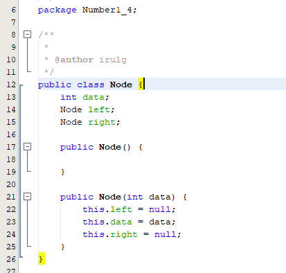
   * 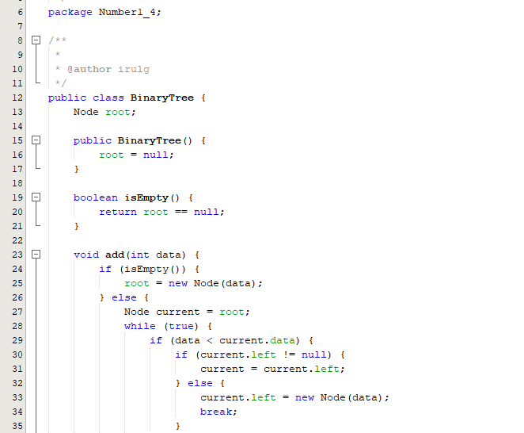
   * 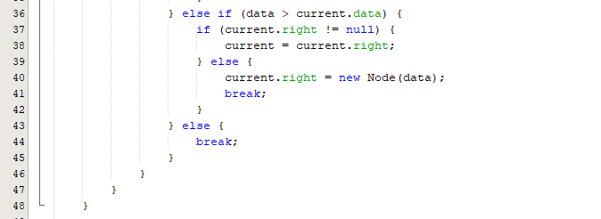
   * 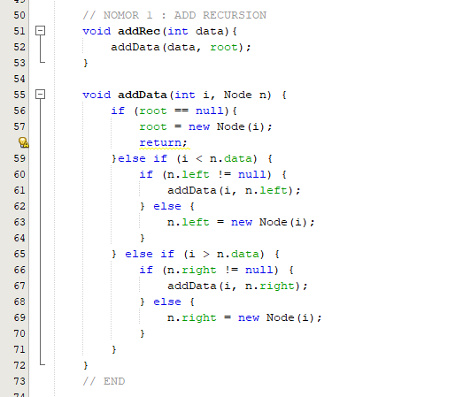
   * 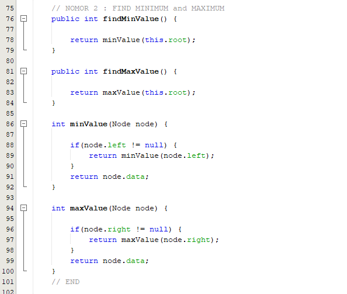
   * 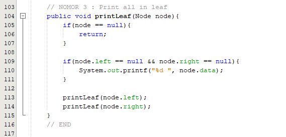
   * 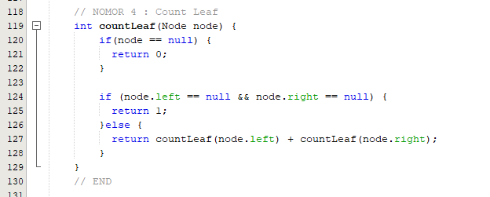
   * 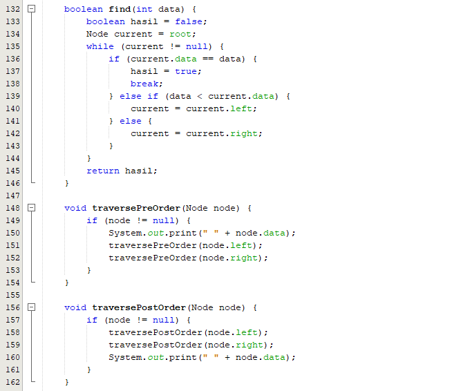
   * 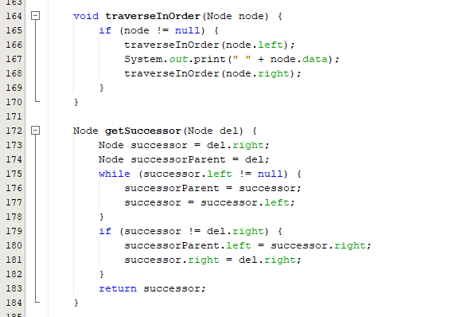
   * 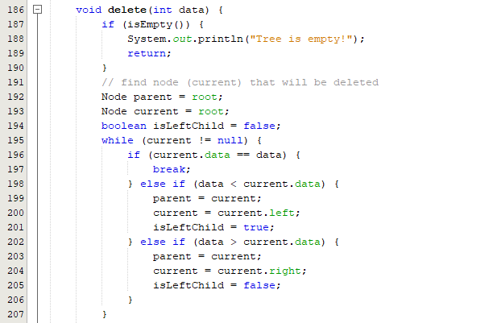
   * 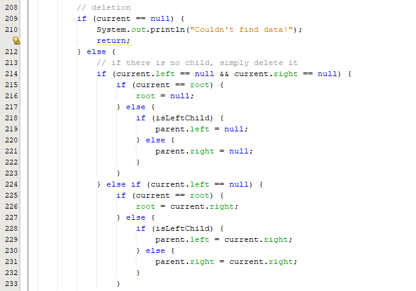
   * 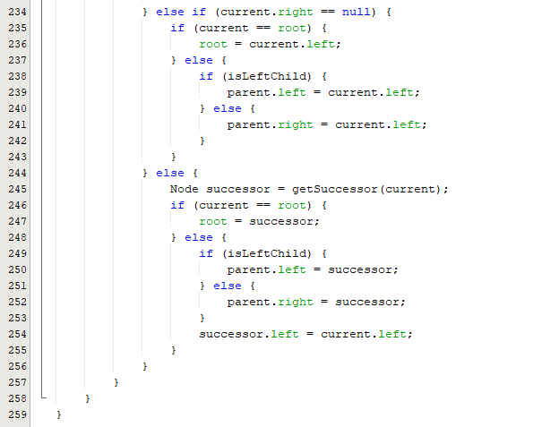
   * 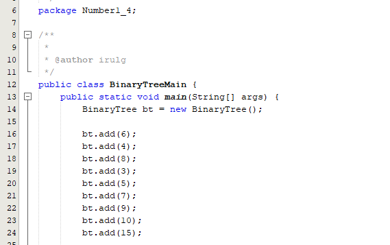
   * 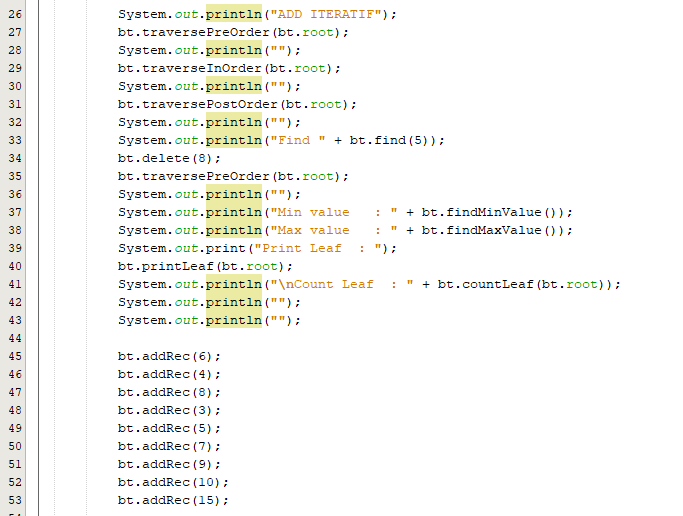
   * 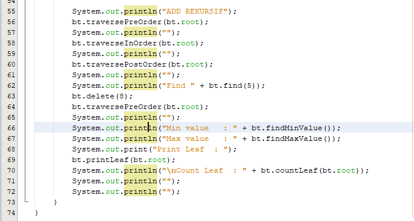
-  Output
   * 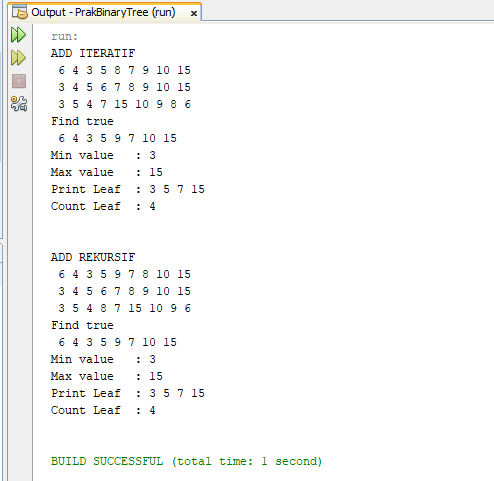

#### Nomor 1-4
-  Code
-  Output

