## LAPORAN PERTEMUAN 15

### 12.2.3 Pertanyaan Percobaan
1.	Sebutkan beberapa jenis (minimal 3) algoritma yang menggunakan dasar Graph, dan apakah kegunaan algoritma-algoritma tersebut? 
    * Algoritma Floyd-Warshall menghitung jarak terpendek (shortest path) untuk semua pasangan titik pada sebuah graph, dan melakukannya dalam waktu berorde kubik. Algoritma warshall digunakan untuk menyelesaikan permasalahan jalur terpendek multi path. Algoritma Floyd-Warshall memiliki input graph berarah dan berbobot (V,E), yang berupa daftar titik (node/vertex V) dan daftar sisi (edge E). Jumlah bobot sisi-sisi pada sebuah jalur adalah bobot jalur tersebut. Sisi pada E diperbolehkan memiliki bobot negatif, akan tetapi tidak diperbolehkan bagi graph ini untuk memiliki siklus dengan bobot negatif. Algoritma ini menghitung bobot terkecil dari semua jalur yang menghubungkan sebuah pasangan titik, dan melakukannya sekaligus untuk semua pasangan titik.
    * Algoritma Kruskal merupakan salah satu algoritma dalam teori graf untuk menyelesaikan persoalan pohon merentang minimum. 
    * Algoritma Dijkstra merupakan algoritma untuk mencari lintasan terpendek yang diterapkan pada graph berarah dan berbobot, yang jarak antara titiknya adalah bobot dari tiap busur pada graph tersebut..

2.	Pada class Graph terdapat array bertipe LinkedList, yaitu LinkedList list[]. Apakah tujuan pembuatan variabel tersebut ? 
    * Ketika graf pertama kali dibuat, dalam konstruktor Graph dideklarasikan list[] bertipe data LinkedLists untuk nantinya menyimpan data graf.
3.	Apakah alasan pemanggilan method addFirst() untuk menambahkan data, bukan method add jenis lain pada linked list ketika digunakan pada method addEdge pada class Graph?
    * Untuk memasukkan data ke dalam antrian
4.	Bagaimana cara mendeteksi prev pointer pada saat akan melakukan penghapusan suatu edge pada graph ?
    * Saat akan menghapus, akan ada pemanggilan method removeEdge() pada class graph. Dari kelas graph, akan ada perulangan dan kondisi, dimana jika memenuhi kondisi tersebut, akan menuju ke method remove yang ada di class LinkedLists, dimana dalam method tersebut ada beberapa kondisi, jika index==0, maka tidak ada data prev nya.

### 12.3.3 Pertanyaan Percobaan
1.	Apakah perbedaan degree/derajat pada directed dan undirected graph? 
    * Directed : Urutan simpul mempunyai arti. Misal busur AB adalah e1 sedangkan busur BA adalah e8.
    * Undirected : Urutan simpul dalam sebuah busur tidak dipentingkan. Misal busur e1 dapat disebut busur AB atau BA.
2.	Pada implementasi graph menggunakan adjacency matriks. Kenapa jumlah vertices harus   ditambahkan dengan 1 pada indeks array berikut?
    * Untuk mendeklarasikan twoD_array dengan kedua size nya vertex+1
3.	Apakah kegunaan method getEdge() ? 
    * Berguna untuk  menampilkan suatu lintasan pada vertex.
4.	Termasuk jenis graph apakah uji coba pada praktikum 12.3 ? 
    * Termasuk jenis graph berarah tetapi tidak berbobot
5.	Mengapa pada method main harus menggunakan try-catch Exception ?
    * Berfungsi untuk mengurung eksekusi yang menampilkan error dan dapat membuat program tetap berjalan tanpa dihentikan secara langsung. Error yang ditangani oleh try…catch disebut dengan exception. Untuk mendeklarasikan twoD_array dengan kedua size nya vertex+1

### TUGAS
#### Nomor 1
-  Code
   * 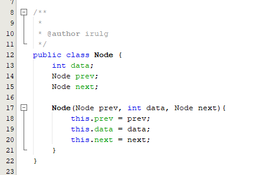
   * 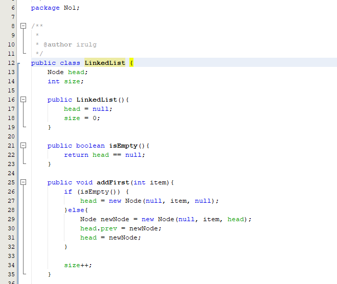
   * 
   * 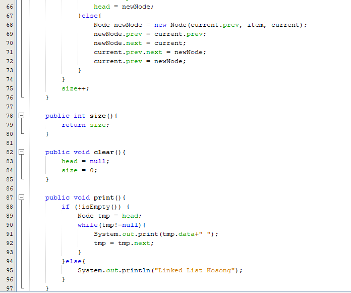
   * 
   * 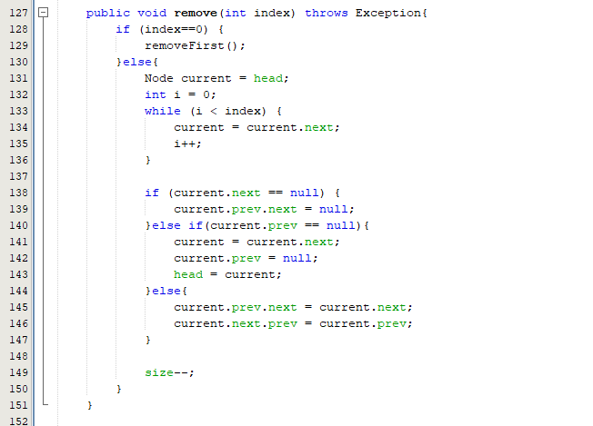
   * 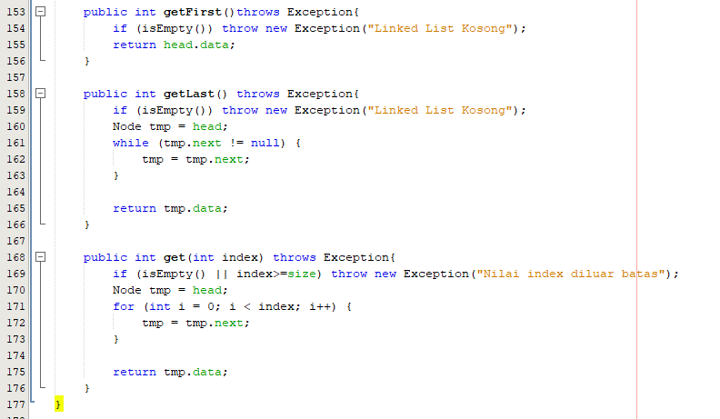
   * 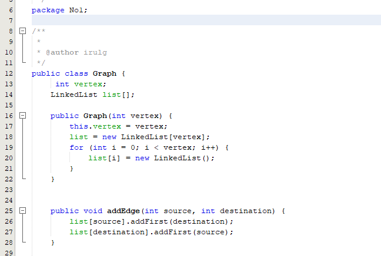
   * 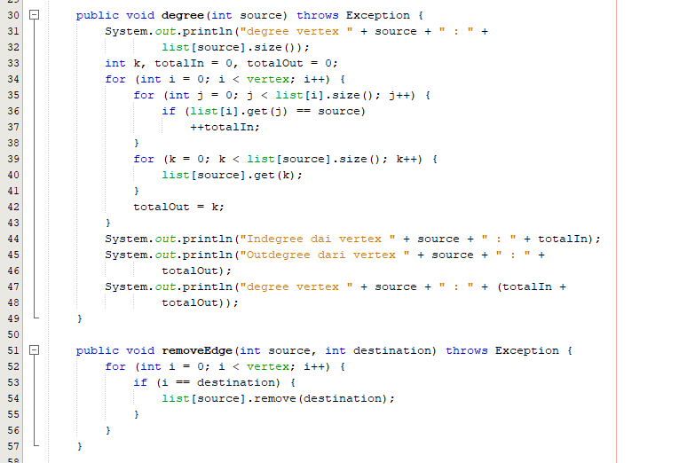
   * 
   * 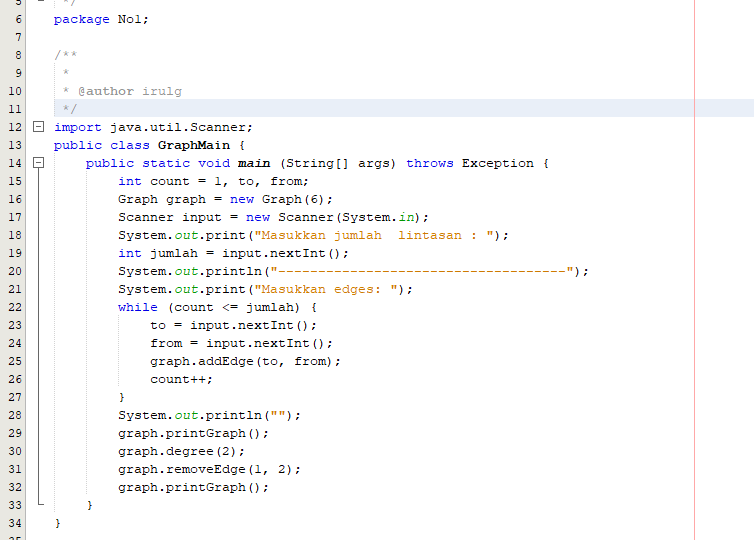
-  Output

#### Nomor 2
-  Code
   * 
   * 
   * 
   * 
   * 
   * 
   * 
   * 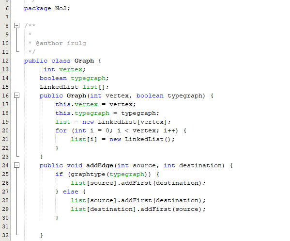
   * 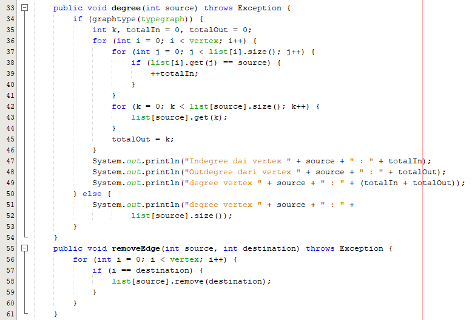
   * 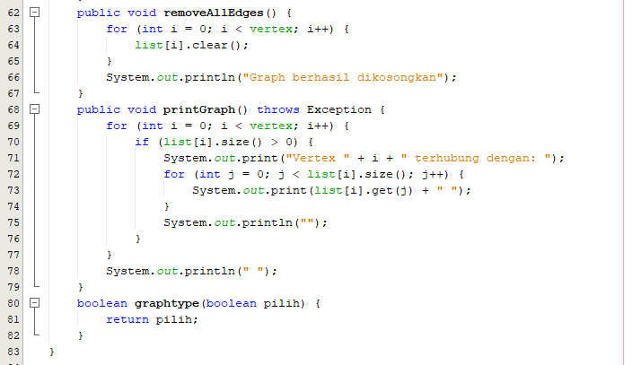
   * 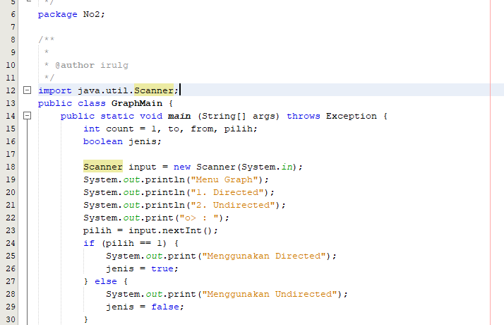
   * 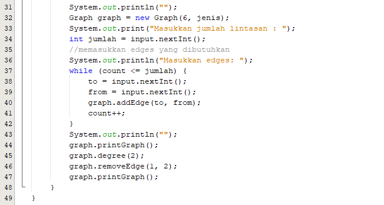
-  Output

#### Nomor 3
-  Code
   * 
   * 
   * 
   * 
   * 
   * 
   * 
   * 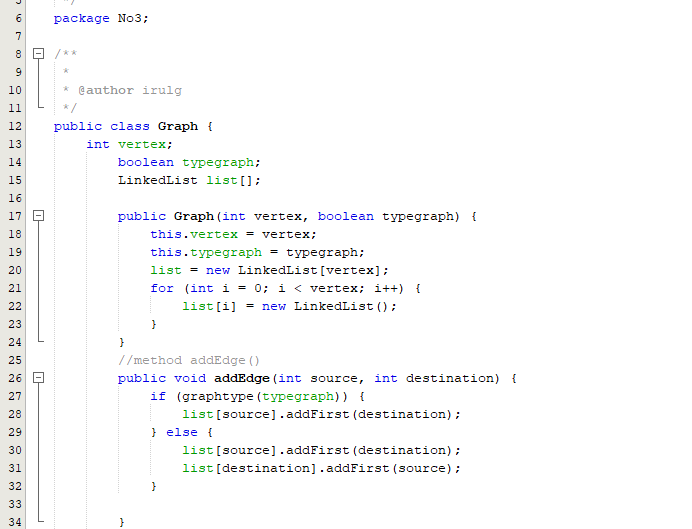
   * 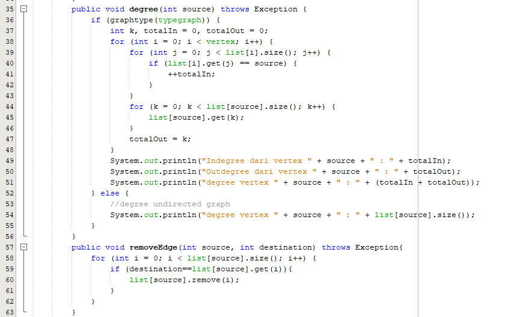
   * 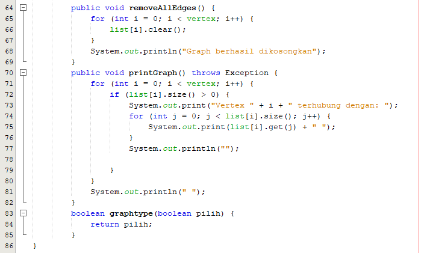
   * 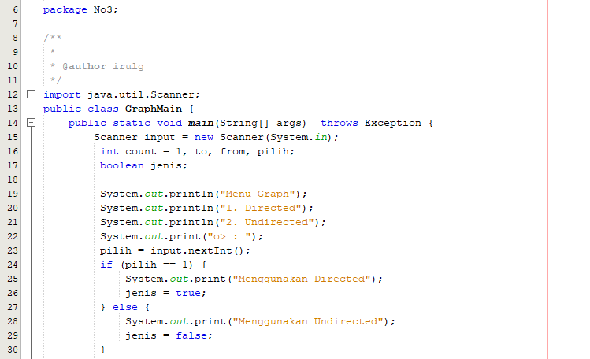
   * 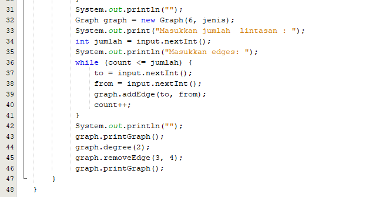
-  Output

#### Nomor 4
-  Code
   * 
   * 
   * 
   * 
   * 
   * 
   * 
   * 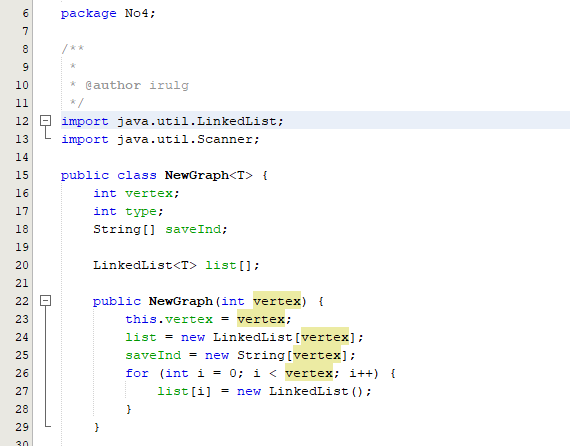
   * 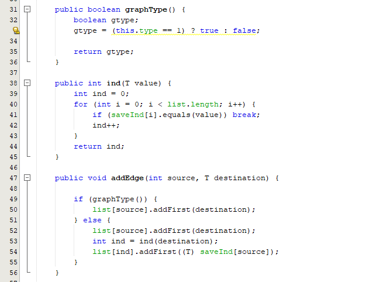
   * 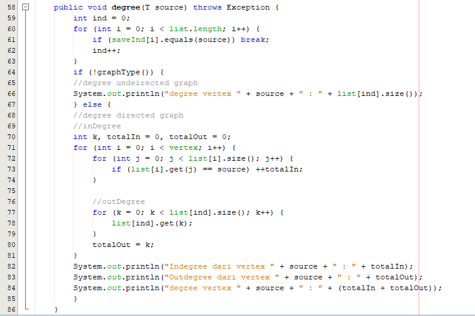
   * 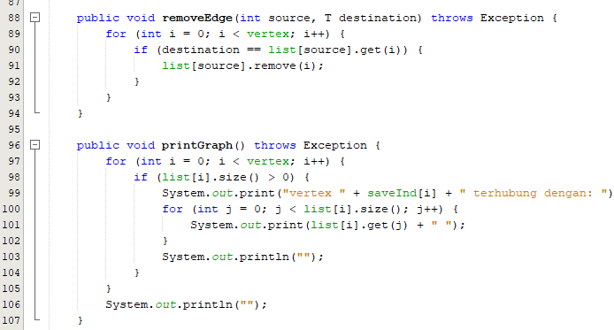
   * 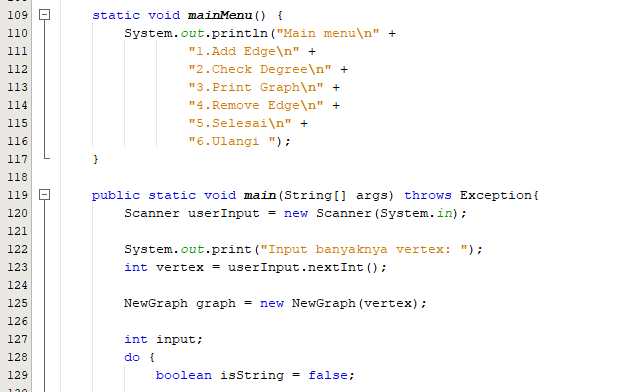
   * 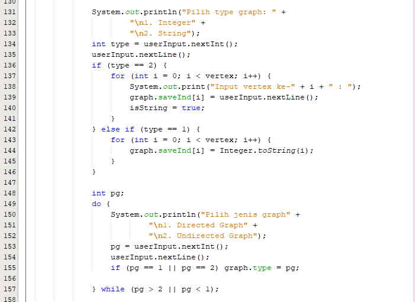
   * 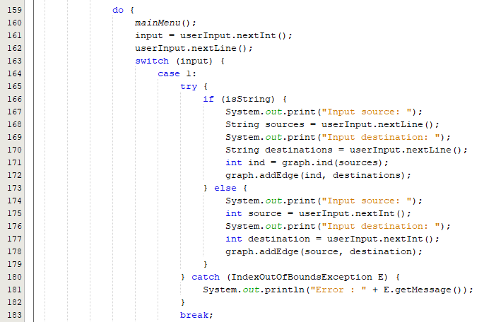
   * 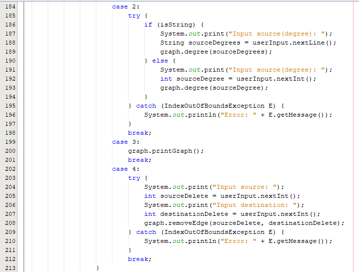
   * 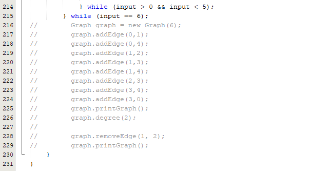
-  Output