## LAPORAN PERTEMUAN 16

### 16.2.2 Pertanyaan Percobaan
1. Karena pada baris kode 25-36 tidak ada kurung siku (<>) yang menyatakan sebuah tipe data tertentu. Sehingga sebuah Arraylist tersebut dapat menampung semua jenis tipe data yang diinputkan.
2. 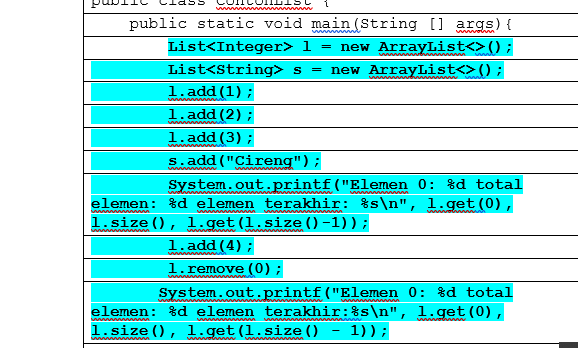
    - 

3. 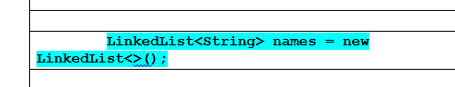
    - 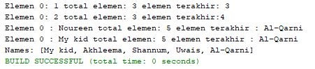
    Hasil outputnya sama . Karena List termasuk pengimplementasannya ArrayList secara internal menggunakan array dinamis untuk meyimpan elemen. Sementara LinkedList secara internal digunakan untuk menyimpan elemen dari daftar tertaut ganda. Sebuah kelas ArrayList dapat menjadi seperti sebuah list karena hal tersebut hanya mengimplementasi List. Sementara kelas LinkedList dapat menjadi sebuah daftar dan antrian karena mengimplementasikan antarmuka List dan Deque.
4. 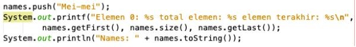
    - 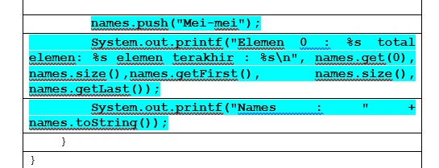
5. 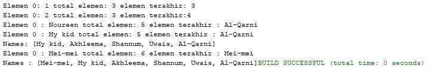
    - Kode tersebut untuk menambahkan elemen baru berupa (Mei-mei) yang kemudian dengan perintah names.getFirst(). Yang artinya, perintah tersebut meletakkan elemen baru berupa ( Mei-mei ) tersebut pada urutan paling awal. names.size() perintah tersebut untuk menampilkan total elemen dan names.getLast() untuk menampilakan elemen paling akhir yaitu Al_Qarni. Dan pada kode tambahan tersebut juga menggunakan LinkedList yang sebelumnya menggunakan Linked saja. Di mana LinkedList digunakan saat terdapat perintah yang berbeda dalam penambahan elemen baru yaitu berupa perintah push. Padahal dapat kita ketahui perintah push hanya berlaku pada Stack( Linked List sebagai tempat penyimpanan data yang terdiri dari dua bagian/field dan menggunakan jenis tipe data string dan yang bisa ditambahkan yaitu yang tipe data nya String). Sehingga kita menggunakan LinkedList

## 16.3.3 Pertanyaan Percobaan

1.	Pada funsi tersebut keduanya sama – sama berfungsi untuk menambahkan sebuah elemen, tetapi fungsi push() dimiliki oleh Stack, sedangkan fungsi add() dimiliki oleh List. Sehingga untuk menggunakan kedua fungsi tersebut harus mengetahui dulu apakah kita menggunakan Stack atau sedang menggunakan List ( menyesuaikan pemakaian ).
2. 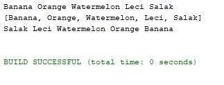
    Karena ketika 5 buah tersebut sudah diambil dengan perintah :
    Sehingga kelima buah tersebut telah habis ( salak, leci, watermelon, orange, banana). Kemudia ditambahkan berupa melon dan durian. Namun perintah pada soal ini dihapus penambahan kedua  uah tersebut sehingga tidak ada inputan yang akan diproses pada tahap selanjutnya. Sehingga output akan berakhir pada pengambilan 5 buah sebelumnya.
    - 
3. Fungsi pada baris 46-49 adalah untuk mengakses dan menampilkan nilai, dari seluruh element yang ada pada Stack. Menggunkan method hasNext(), untuk mengecek kondisi apakah objek iterator masih mempunyai nilai pada selanjutnya atau tidak. Sedangkan, kita menggunakan method .next() , untuk menampilkan nilai selanjutnya pada element.
4. 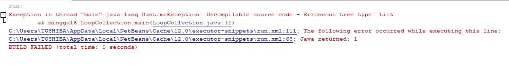
    Karena pada List untuk menambahkan elemen tidak dapat menggunakan fungsi push() tersebut. Fungsi push() hanya berlaku pada Stack. Sehingga jika menggunakan sub collection berupa List sehingga, harus menggunakan fungsi add() untuk menambahkan elemen yang akan diinputkan
5. 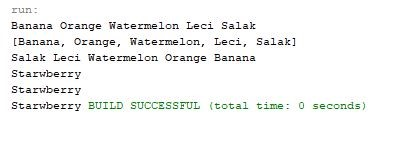
6. 

### 12.4.3 Pertanyaan Percobaan
1.	Pada fungsi tambah() menggunakan parameter berupa unlimited argument, parameter terssebut agar kita dapat menyeseuaikan inputan nilai yang akan kita gunakan. Arti dari argumen itu sendiri adalah argumen adalah sebutan untuk nilai inputan fungsi pada saat fungsi itu dipanggil. Sehingga kelebihannya, ketika terdapat parameter tambahan atau lebih bahkan kurang dari yang kita perkirakan tidak akan mempengaruhi. Karena parameter argumen ini akan menyesuaikan kebutuhan pengguna.
2. 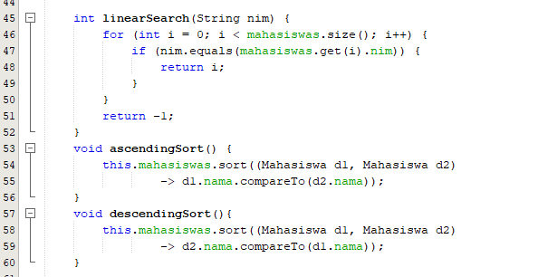
3. 

### TUGAS
#### Nomor 1
-  Code
   * 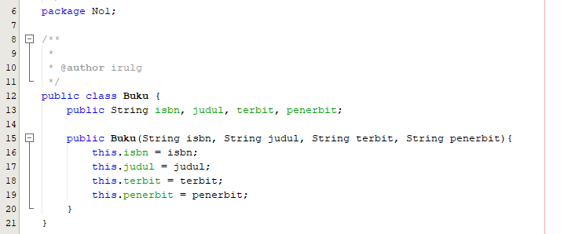
   * 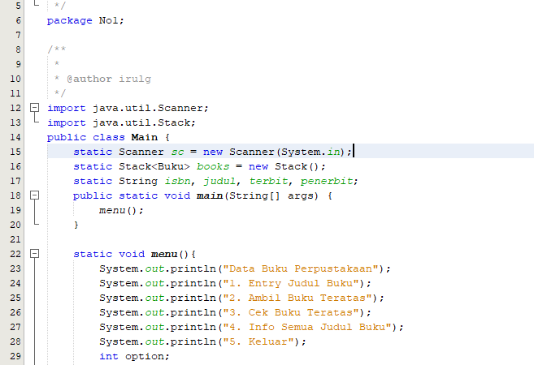
   * 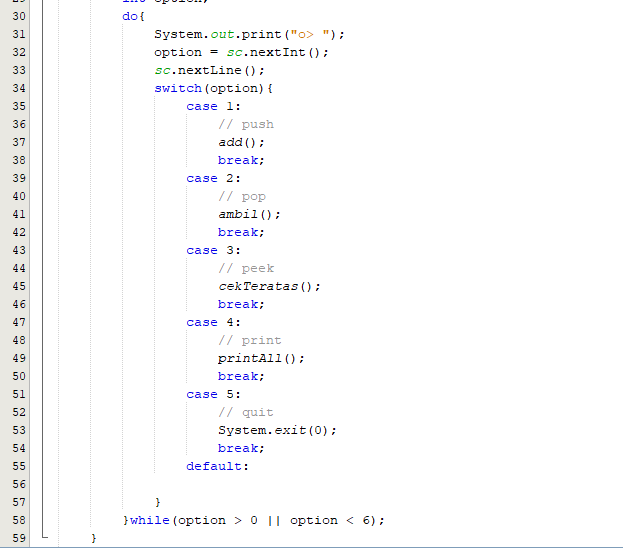
   * 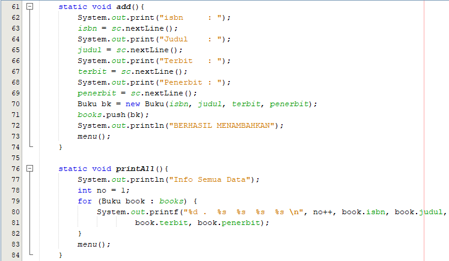
   * 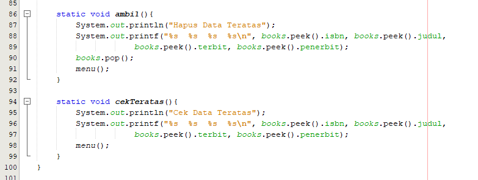
-  Output
   * 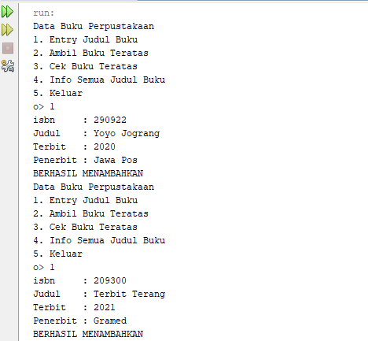
   * 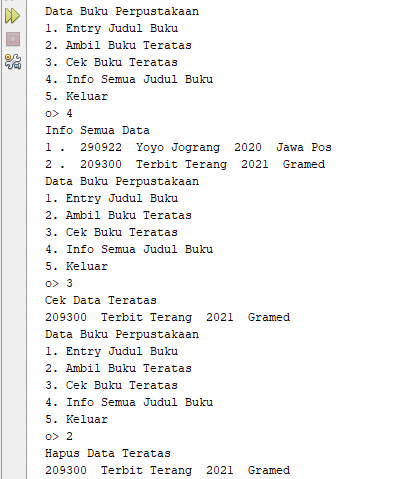
   * 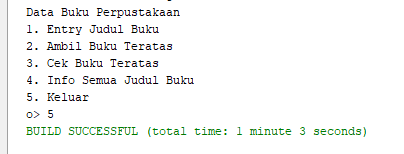

#### Nomor 2
-  Code
   * 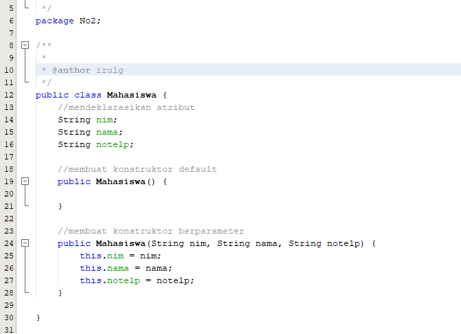
   * 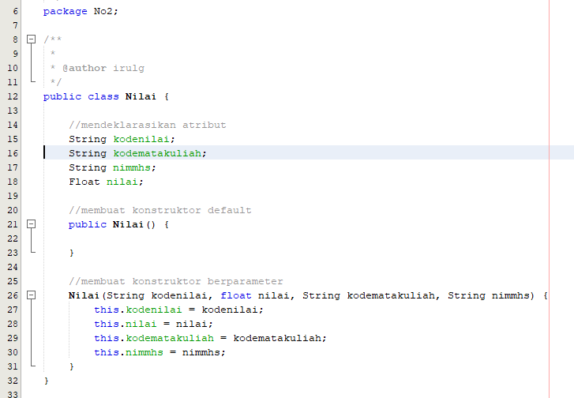
   * 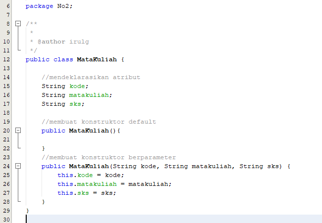
   * 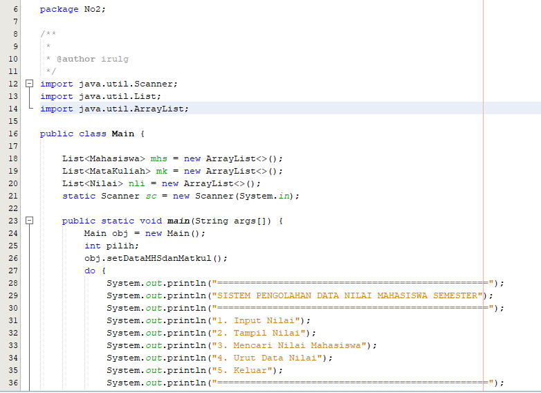
   * 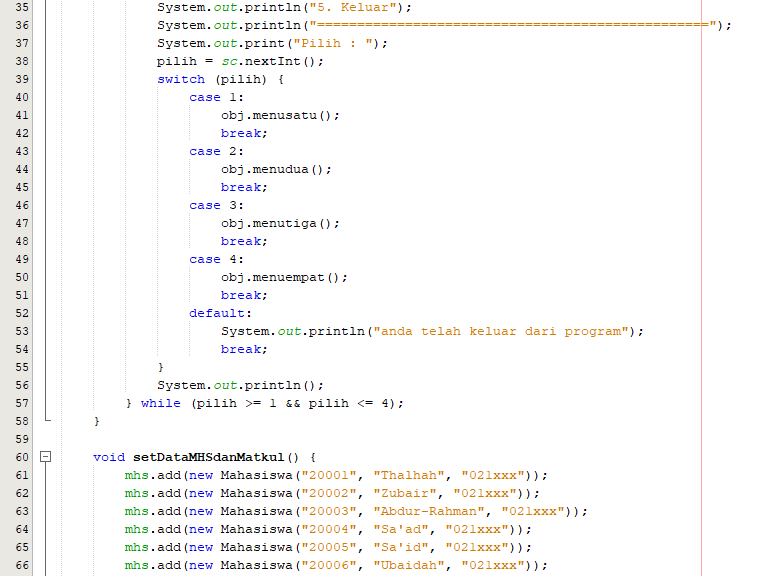
   * 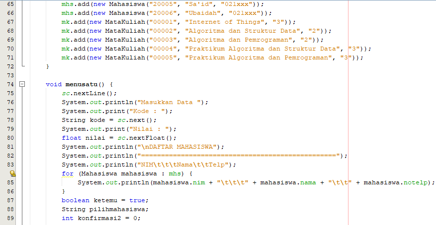
   * 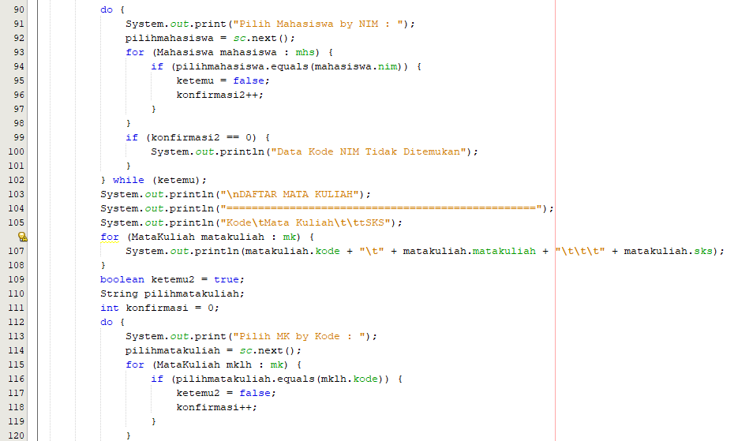
   * 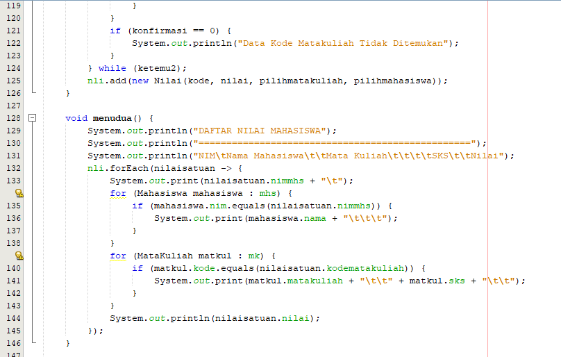
   * 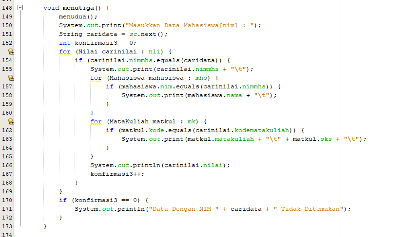
   * 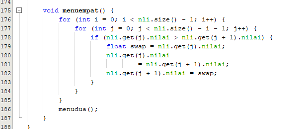
-  Output
   * 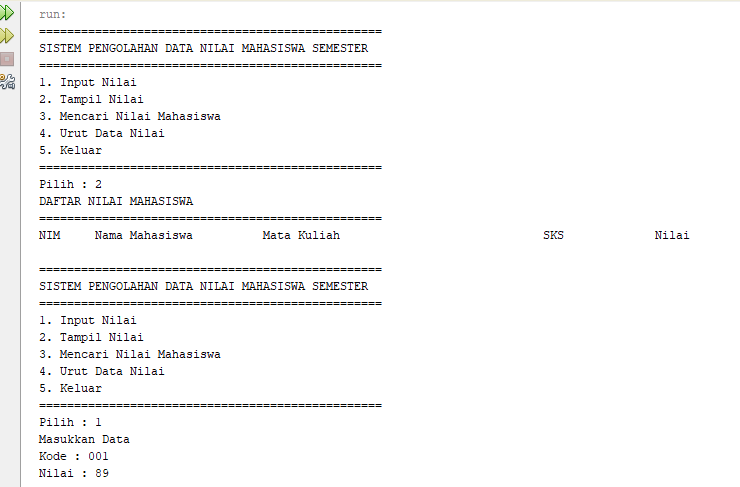
   * 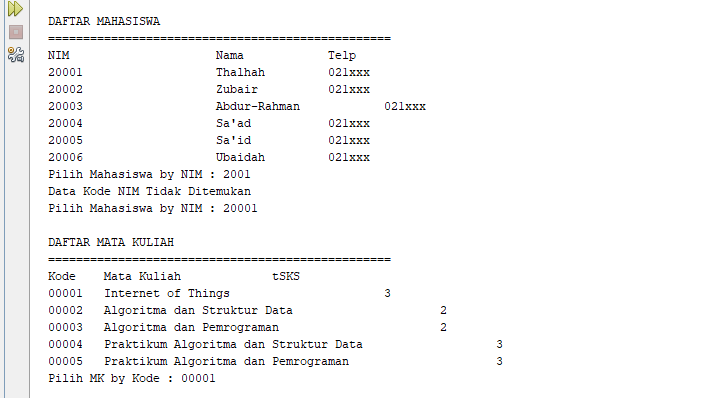
   * 
   * 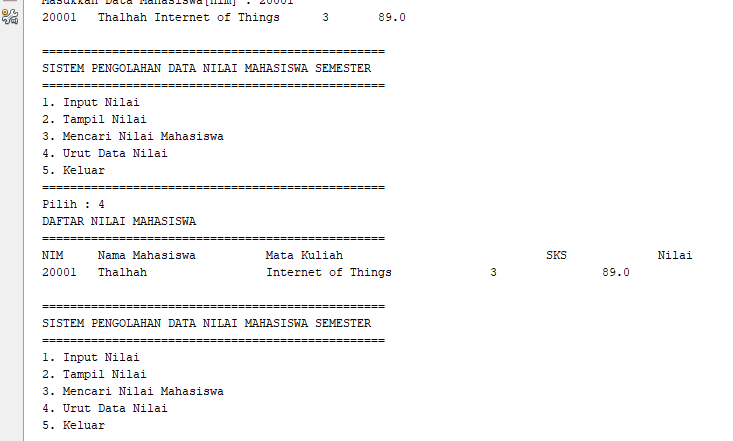