# Laporan Pertemuan 2

### 2.2.3 Pertanyaan
1. Atribut dan Behavior(Sifat)
2. class
3. ada 4 atribut. String namaBrang, jenisBarang(Line 13), int stok, hargaSatuan (Line 14)
4. ada 4 method yaitu 
    * tamilBarang(), -> untuk menampilkan data barang
    * tambahStok(int n), -> menambah stok barang
    * kurangiStok(int n), -> mengurangi stok barang
    * hitungHargaTotal(int jumlah) -> menghitung total dari jumlah pembelian barang
5. 
6. Untuk mengurangi jumlah stok yang ada menggunakan bilangan bulat n
7. karena untuk penjumlahan aritmatika
8. karna tidak mengembalikan nilai

### 2.3.3 Pertanyaan
1. Pada baris ke 15 , nama objek yang di hasilkan adalah <i>b1</i>
2. cara mengakses atribut dan method dengan cara , nama_objek.atribut / nama_objek.method. <i>misal : b1.namaBarang = "Kecap manis"; </i>
### 2.4.3 Pertanyaan
1. Pada baris 18 hingga 23
2. Membuat objek baru dengan menggunakan konstruktor berparameter
3. 

## 2.5 Latihan Praktikum
1. * Source code-
     - 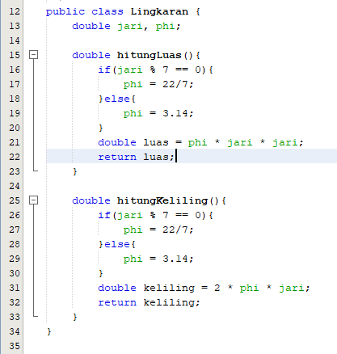
     - 
   * Output
     - 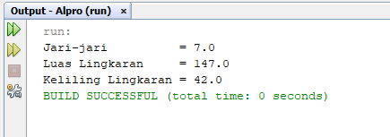
2. * Class Diagram
     - 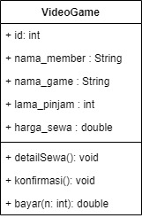
   * Source code
     - 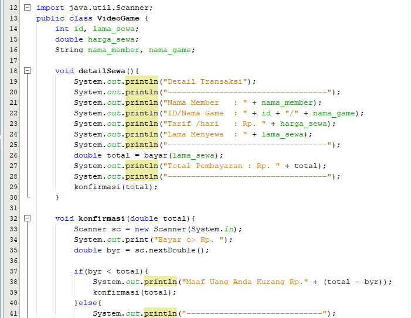
     - 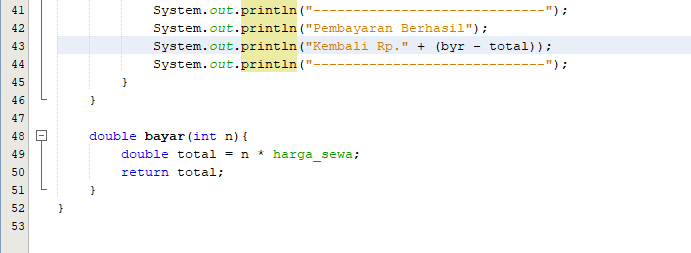
     - 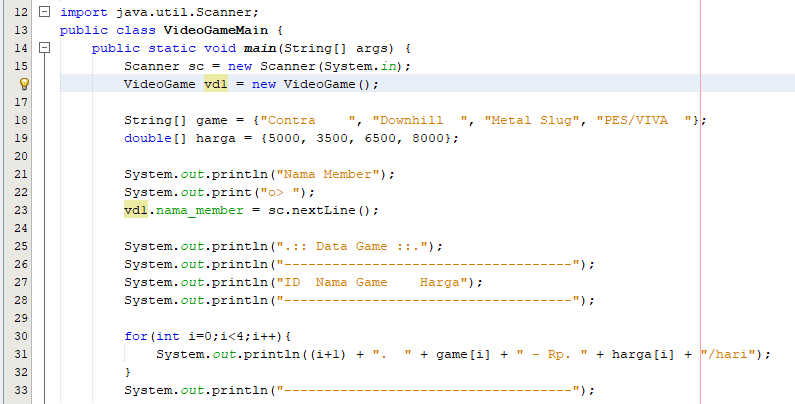
     - 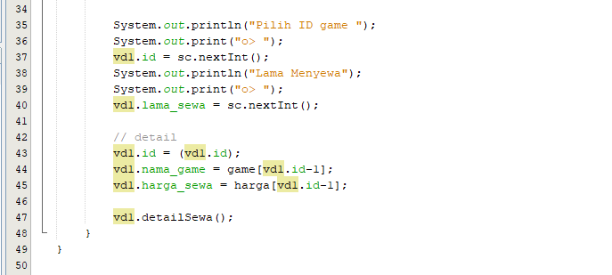
   * Output
     - 
3. * Source code
     - 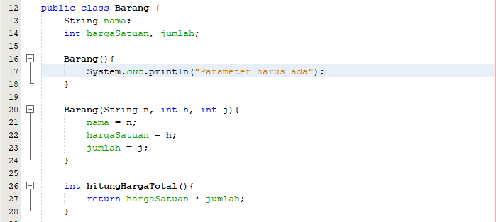
     - 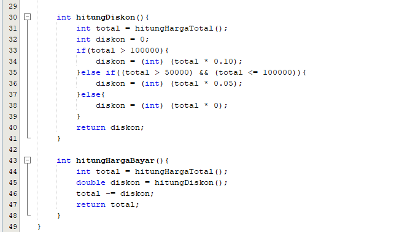
     - 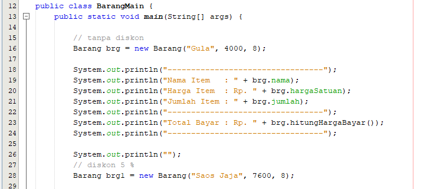
     - 
   * Output
     - 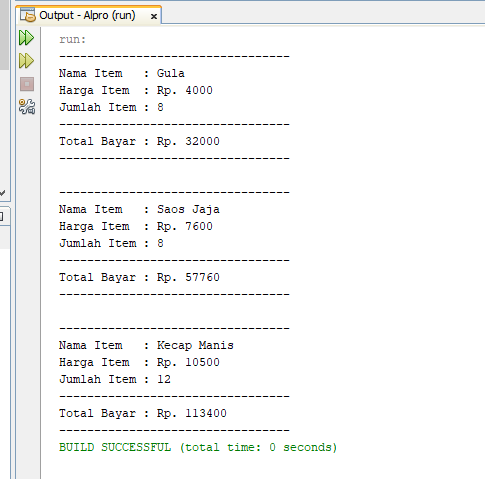
4. * Source code
     - 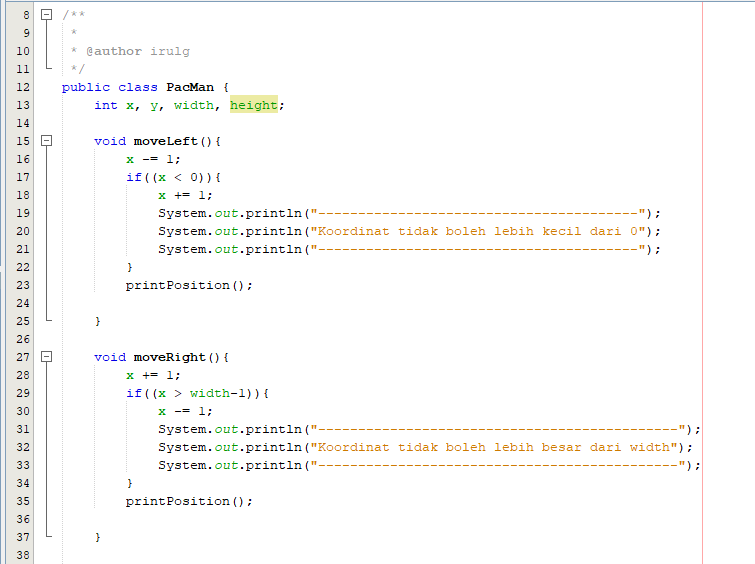
     - 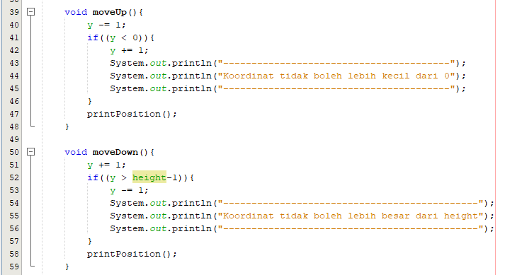
     - 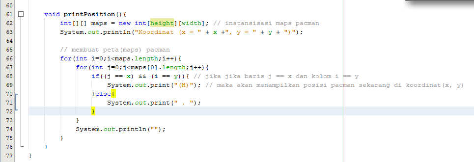
     - 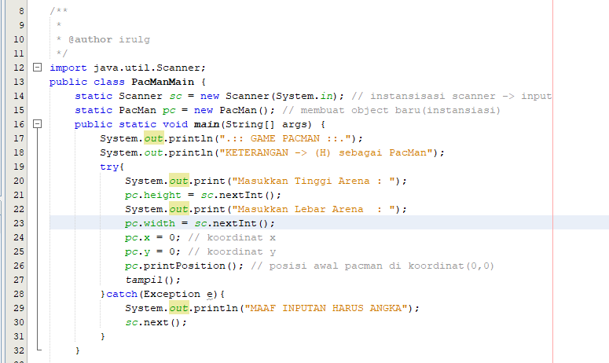
     - 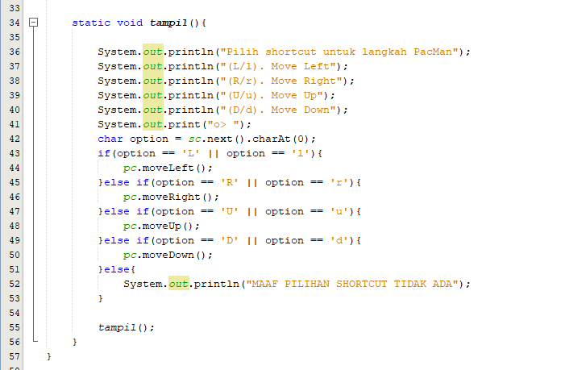
   * Output
     - 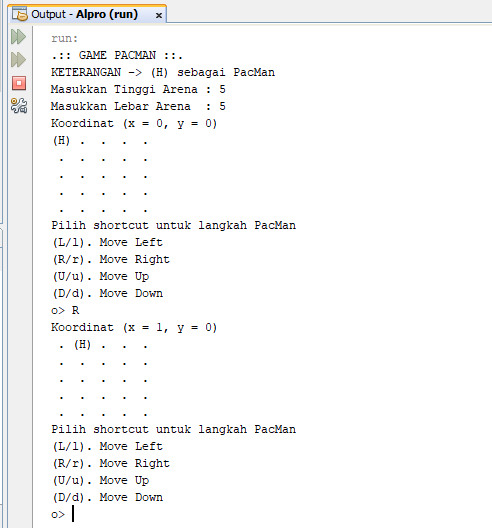
     - 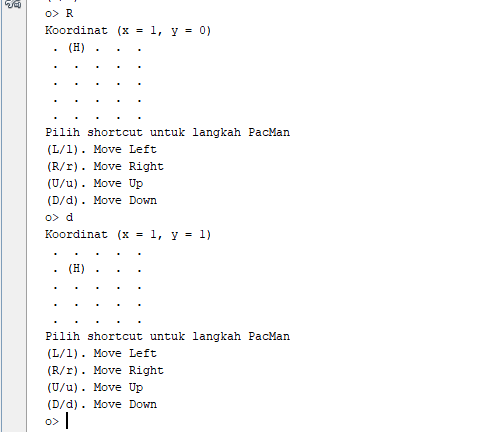
     - 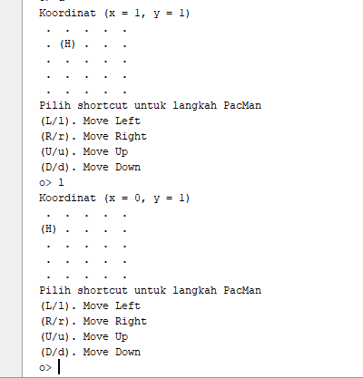
     - 
     

