# Tugas Pertemuan 3

## Pertanyaan 3.2.3
1. Harus, karena class array objek memliki sebuah objek yang akan di proses
2. Tidak, karena (ppArray[1] = new PersegiPanjang()) untuk menginstansiasi objek pada class array objek
3. Instansiasi array objek
4. memberi nilai pada objek yang telah di instansiasi objek
5. kenapa di pisah, supaya konsep yang di jalankan jelas tidak rancu

## Pertanyaan 3.3.3
1. iya
2. Kenapa bisa karena array juga bisa 2D typedata[][] var = new typedata[0][0] -> objek -> classObj[][] var = new classObj[0][0]
3. karena instance dulu baru ada objek2nya di dalamnya -> Persegi[] pgArray = new Persegi()
4. 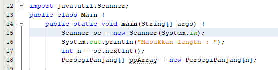
5. Boleh saja, ppArray[0] jika ada dibawahnya ppArray[i] maka terupdate nilainya ada pada ppArray[0]

## Pertanyaan 3.3.4
1. Boleh, karena konstruktor akan di proses jika ada pemanggilan -> (tergantung kebutuhan)
    * 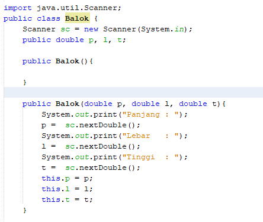  
2. -
3. 
4. 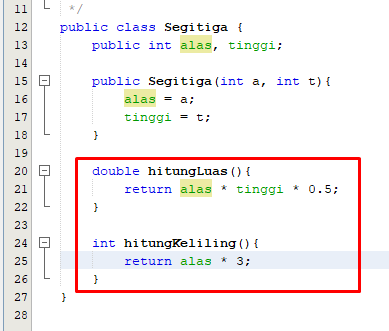  
5. 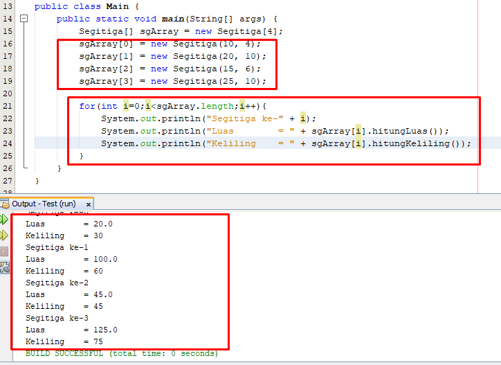  

## 3.5 Latihan Praktikum

1.  Code
    * 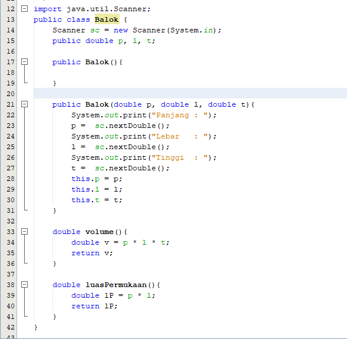
    * 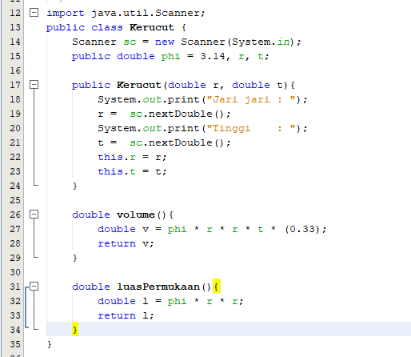
    * 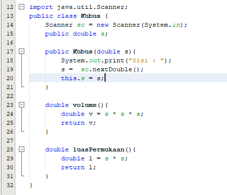
    * 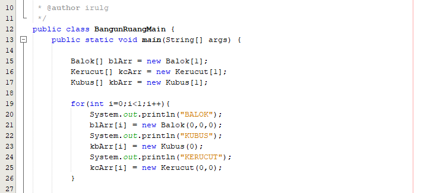
    * 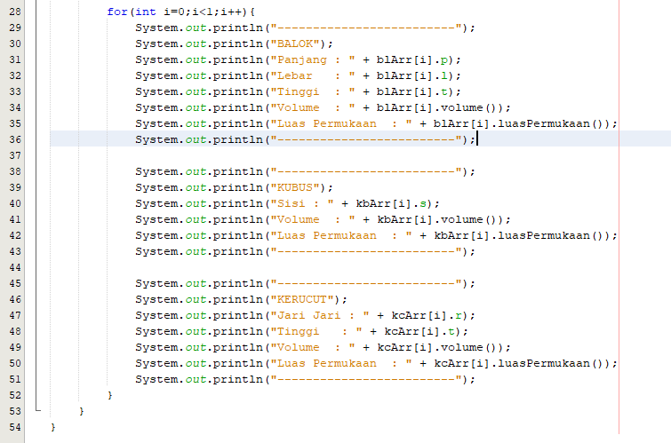
    Ouput
    * 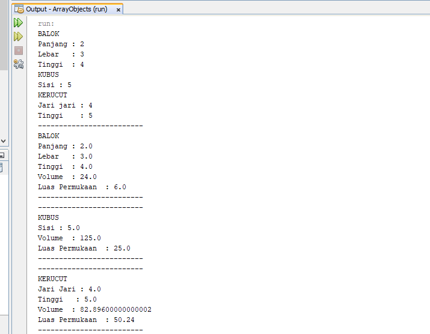
2.  Code
    * 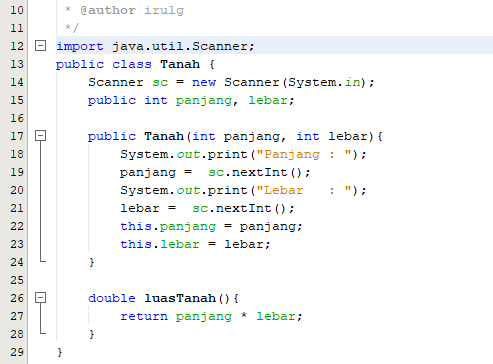
    * 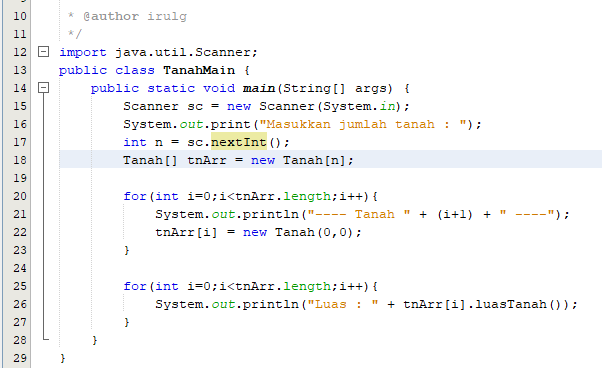
    Ouput
    * 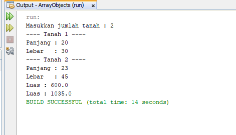
3.  Code
    * 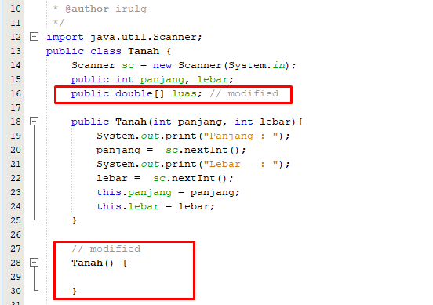
    * 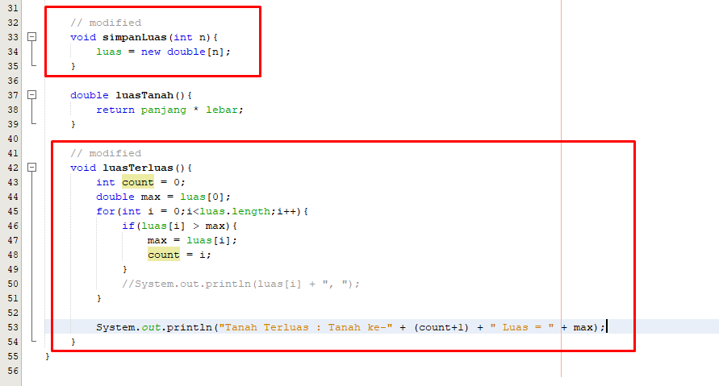
    * 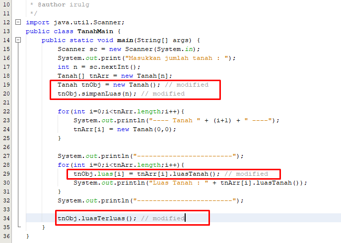
    Ouput
    * 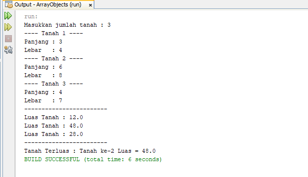
4.  Code
    * 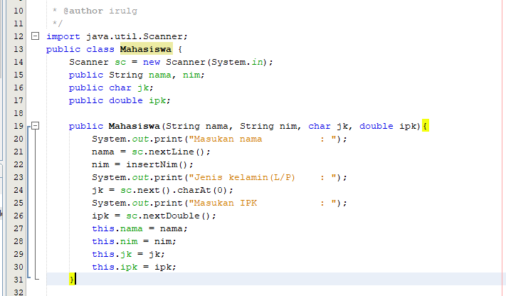
    * 
    * 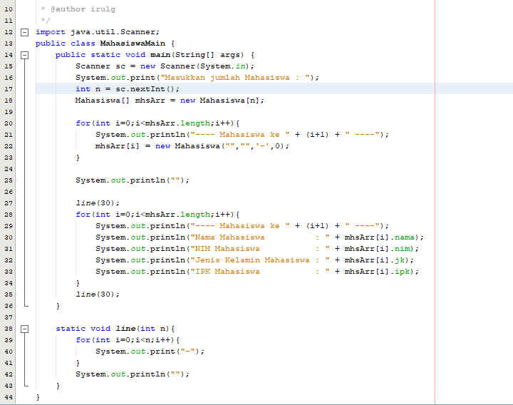
    Ouput
    * 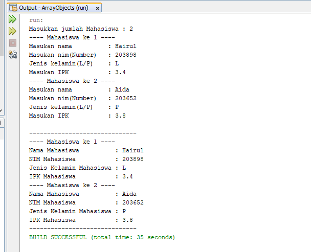
5.  Code
    * 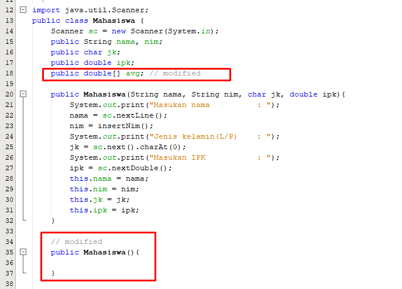
    * 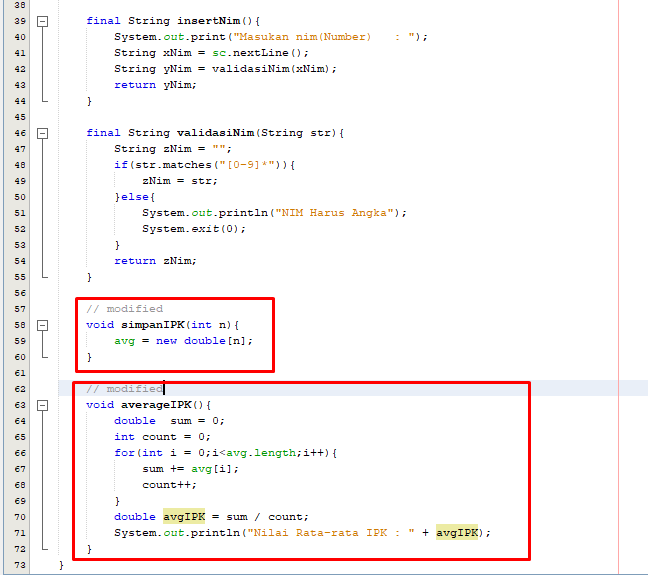
    * 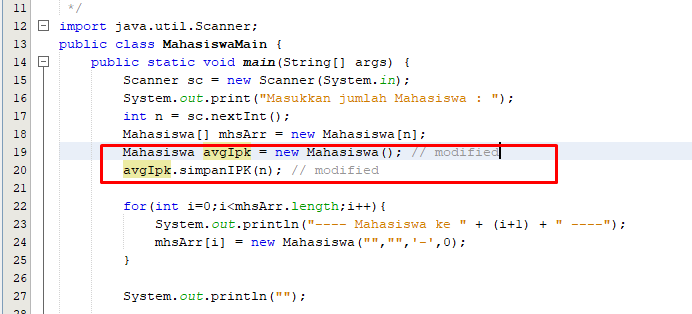
    * 
    Ouput
    * 

