# Brute Force & Devide Conquer (Pertemuan 5)

## Pertanyaan 4.2.3
1. Base line pada faktorial dengan metode divide conquer tersebut adalah apabila nilai n = 1 maka akan mereturn nilai 1 selain itu maka akan mereturn n x faktorial(n-1) //memanggil dirinya sendiri.
2. Benar, Terdiri 3 Tahapan :
    * Proses Devide:
        - int fakto = n * faktorialDC(n-1);
    * Proses conquer:
        - if(n == 1) {return 1;}  
    * Proses combine:
        - return fakto;
3. Ya memungkinkan
    - 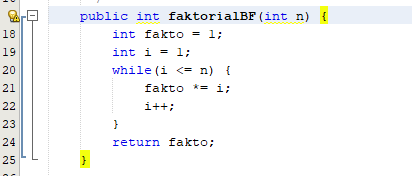
4. Jawab
    - 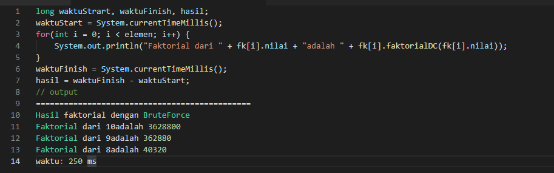
5. Jawab
    - 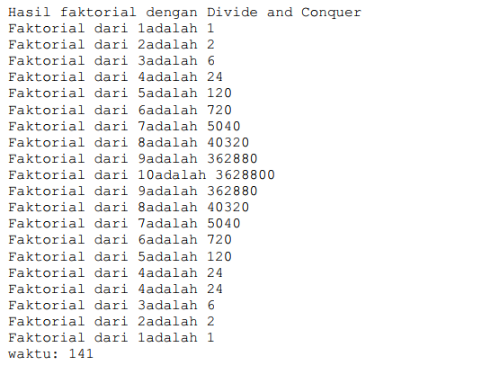
    - 

## Pertanyaan 4.3.3
1. PangkatBF() merupakan method yang mencari hasil dari perpangkatan dari
suatu nilai dengan menerapkan algoritma Brute Force atau dengan cara fundamental.
Sedangkan PangkatDC() merupakan method yang digunakan untuk mencari hasil dari
perpangkatan dari suatu nilai dengan menerapkan algoritma Divide and Conquer atau
dalam implementasinya menggunakan method rekursif yang mana method tersebut
memanggil dirinya sendiri.
2. <i>if(n%2 == 1) return (pangkatDC(a, n/2) * pangkatDC(a,n/2) * a); </i>
Pada potongan kode program di atas berfungsi untuk memvalidasi apabila n adalah
bilangan ganjil maka akan direturn <i>pangkatDC(a, n/2) * pangkatDC(a,n/2) * a;</i>
lalau untuk kode program else <i>return (pangkatDC(a, n/2) * pangkatDC(a, n/2));</i>
Pada kode program diatas digunakan apabila n adalah bilangan selain ganjil, yaitu
bilangan genap, lalu program akan mereturn <i>(pangkatDC(a, n/2) * pangkatDC(a, n/2)</i>
3. Jawab 
<i>return (pangkatDC(a, n/2) * pangkatDC(a,n/2) * a);
return (pangkatDC(a, n/2) * pangkatDC(a, n/2));</i>

4. Jawab
    - 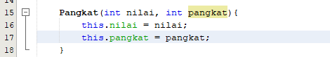
    - 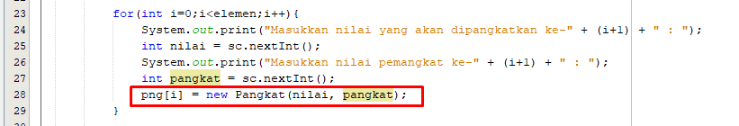
5. Jawab 
    - 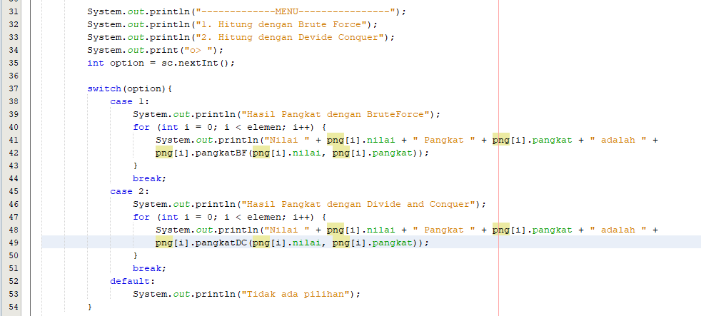

## Pertanyaan 4.4.3
1. Jawab
    - A. Perbedaan perhitungan yang terjadi pada method TotalBF() yakni, kode program
    terkesan lebih ringkas dan sederhana, kemudian menjadikannya lebih mudah untuk
    dipahami dan menghasilkan algoritma yang standar dalam menjalankan proses
    komputasi.
    - B. Perbedaan perhitungan yang terjadi pada method TotalDC() adalah kode program
    terlalu panjang dan susah untuk dipahami, namun dengan menggunakan method ini
    kita memiliki begberapa keuntungan di antaranya, dapat memecahkan masalah yang
    sulit dan juga memiliki algoritma yang efisien yang mana dapat melakukan proses
    secara paralel.
2. Jawab
    - 
3. Return value tersebut digunakan untuk mengembalikan nilai dari variabel lsum,
variabel rsum dan variabel <i>arr[mid]</i> yang mana masing2 dijumlahkan terlebih dahulu,
atau dalam Divide and Conquer tahap ini merupakan tahap combine.
4. karena nilai dari variabel mid merupakan index tengah2 dari elem array
tersebut, apabila tidak ada maka array pada index tengah-tengah tidak akan ikut
terjumlahkan.
5. Jawab
    - 
    - 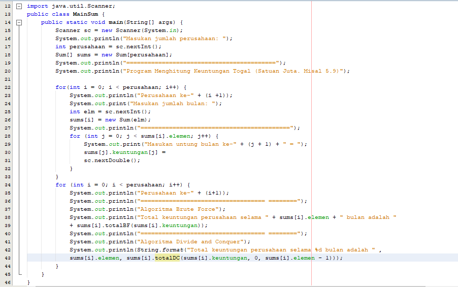

## Latihan Praktikum (SOAL) TUGAS
1. Code
    * 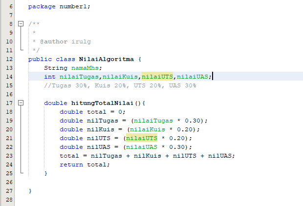
2. Code
    * 
    * 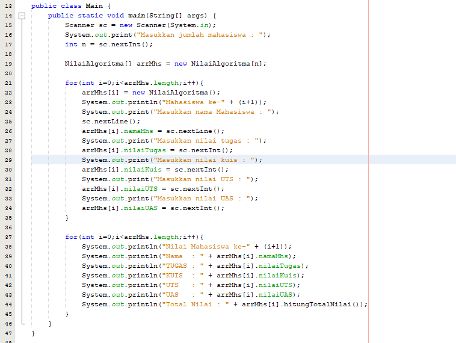
   Output
    * 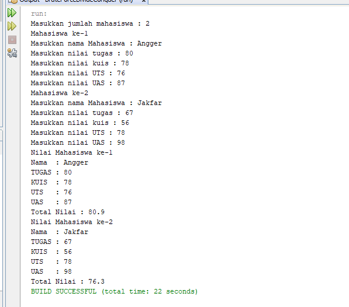
3. Code
    * 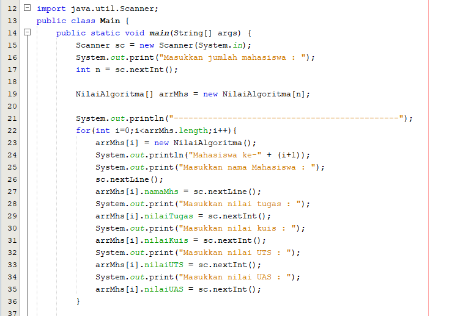
    * 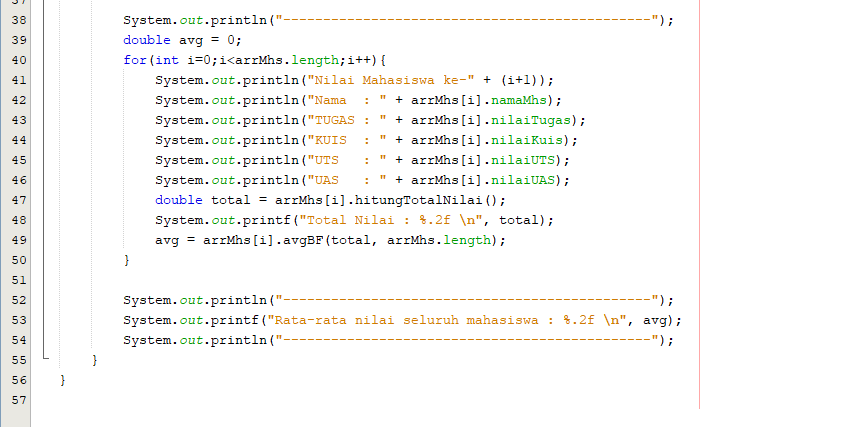
    * 
   Output
    * 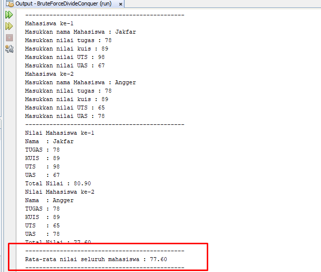
4. Code
    * 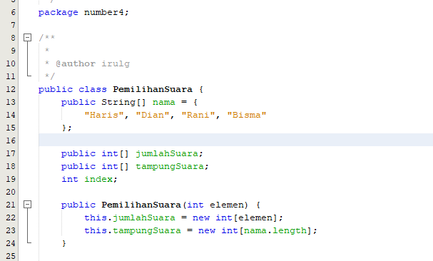
    * 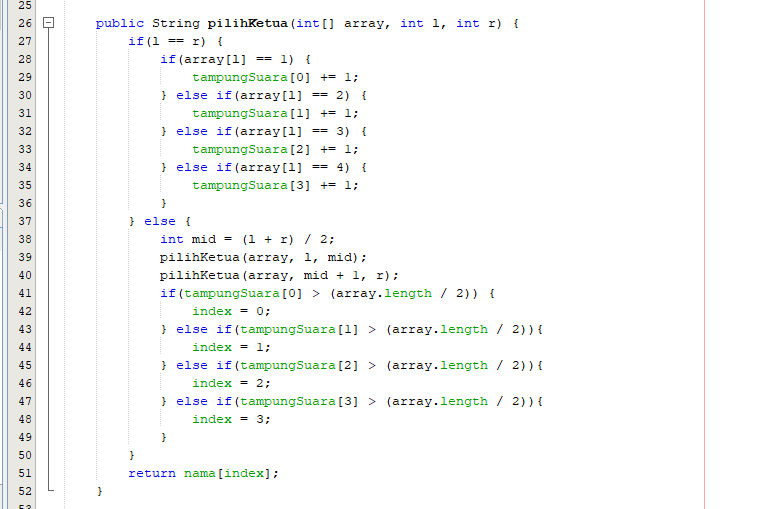
    * 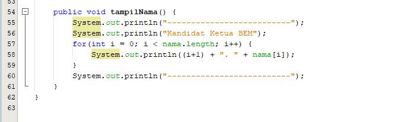
    * 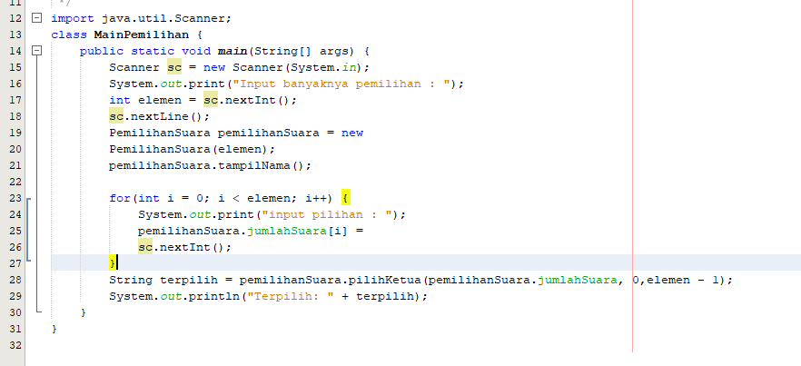
   Output
    * 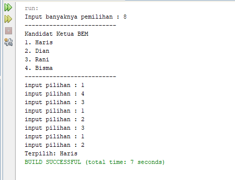