# Laporan Peremuan 6

## 5.2.3 Pertanyaan
1. Method void bubbleSort(){}
2. Tidak ada
3. swap merupakan proses pertukaran nilai pada suatu variabel dengan variabel lainnya.
    * 
4. Untuk mengurutkan data berdasarkan yang lebih besar(DESC). dan juga proses swap
5. Jawab
    * A. Perulangan i digunakan untuk melakukan perulangan luar atau outter loop sedangkan perulangan j digunakan utnuk perulangan dalam atau inner loop pada perulangan j ini proses yang dilakukan adalah membandingkan seluruh elemen pada array
    * B. Karena untuk mengulang sebanyak n kali, n disini adalah index terakhir dari array
    * C. Karena untuk mengulang sebanyak n - i, jadi pada perulangan ini batasnya akan terus berjalan, karena data pada elemen terakhir adalah data yang telah ter urut, jadi tidak perlu dilakukan pengecekan atau perulangan lagi.
    * D. 50 kali, kemungkinan bubble sort adalah 1275 kali, namun hal tersebut juga diepngaruhi oleh data(susunannya)

## 5.3.3 Pertanyaan
    1. proses di atas digunakan untuk mencari nilai terkecil dari data yang berada di
    kanan. Misal data sebagai berikut: [8,3,1,7]
    Proses ke-1
    i = 0;
    idxMin = 0;
    j = 1;
    listMhs[j].ipk < listMhs[idxMin].ipk = true
    idxMin = 1;
    Proses ke-2
    idxMin = 1;
    j = 2;
    listMhs[j].ipk < listMhs[idxMin].ipk = true
    idxMin = 2;
    void selectionSort() {
    Mahasiswa tmp;
    for(int i = 0; i < listMhs.length - 1; i++) {
    int idxMin = i;
    for(int j = i + 1; j < listMhs.length; j++)
    {
    if(listMhs[j].ipk <
    listMhs[idxMin].ipk) {
    idxMin = j;
    }
    }Proses ke-3
    j = 3
    idxMin = 2;
    listMhs[j].ipk < listMhs[idxMin].ipk = false
    idxMin = 2;
    //result elem terkecil ada pada index ke 2

## 5.4.3 Pertanyaan
1. 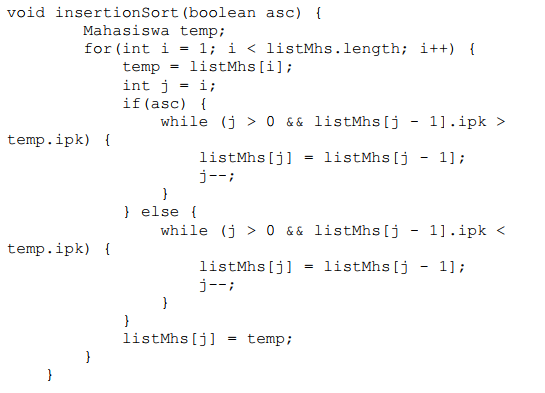

## Latihan Praktikum
1. Code
    * 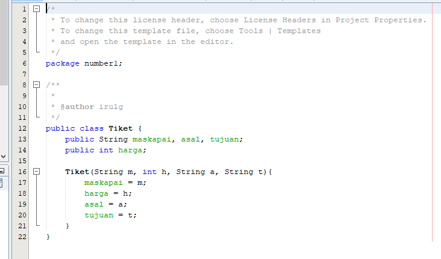
    * 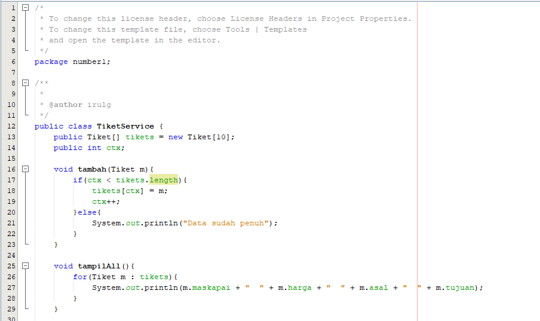
    * 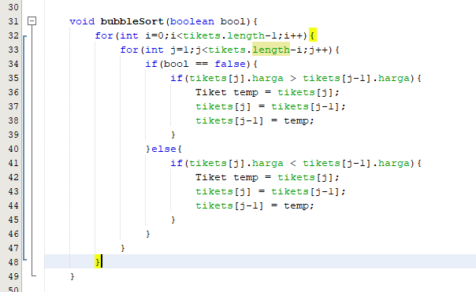
    * 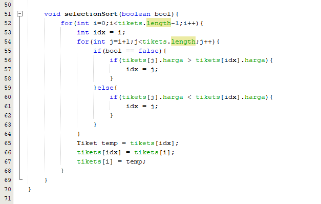
    * 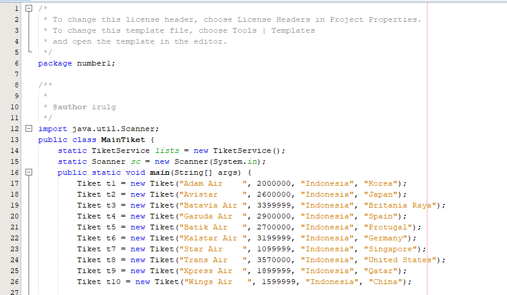
    * 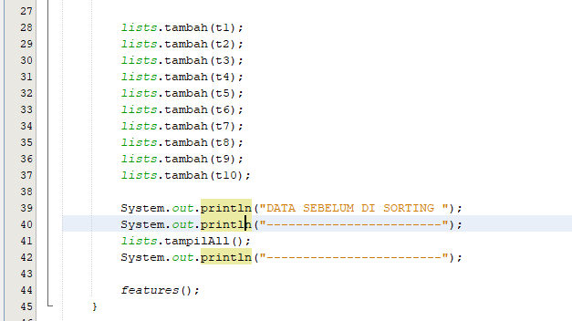
    * 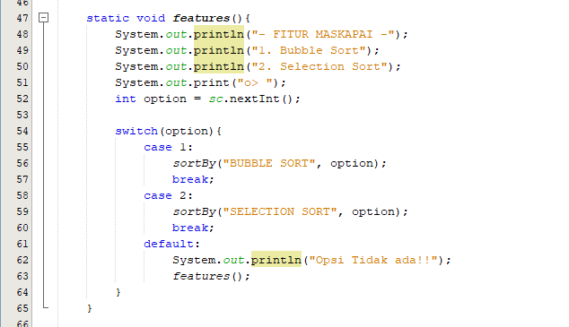
    * 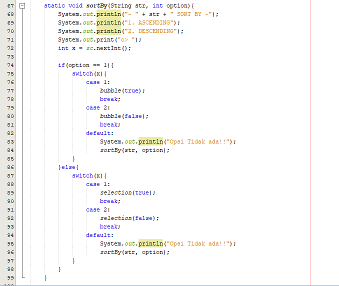
    * 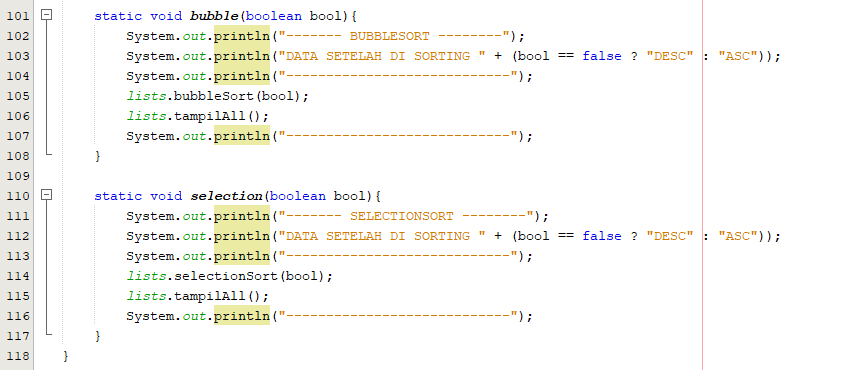 
   Output
    * 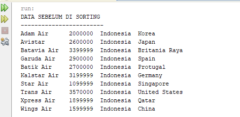
    * 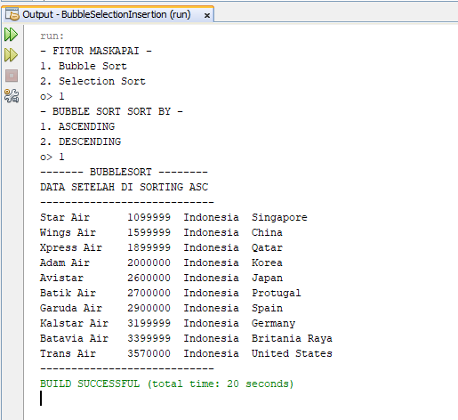
    * 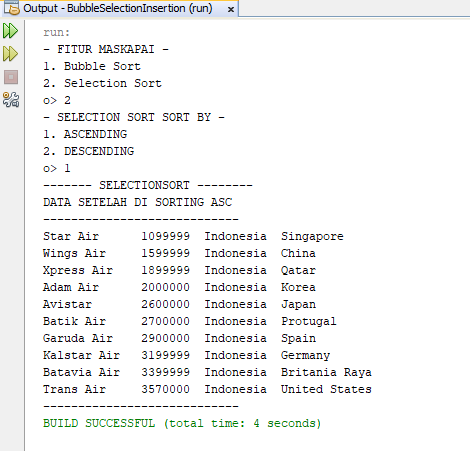
2. Code
    * 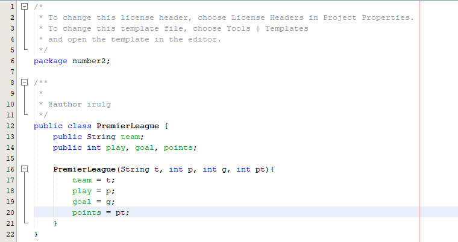
    * 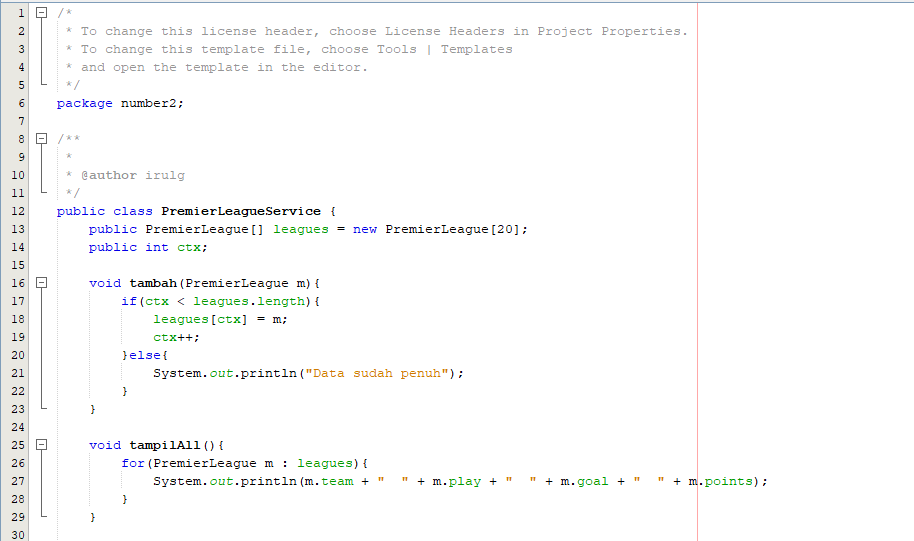
    * 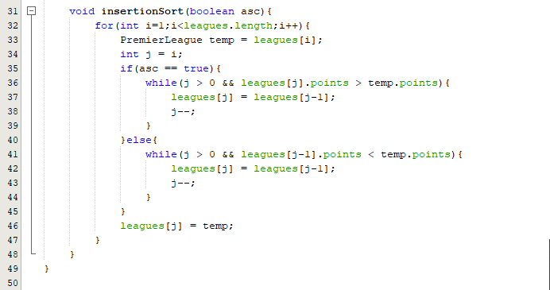
    * 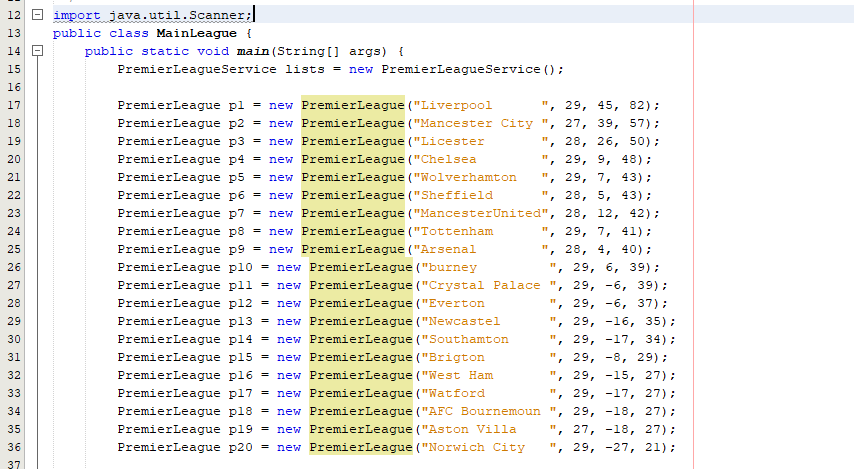
    * 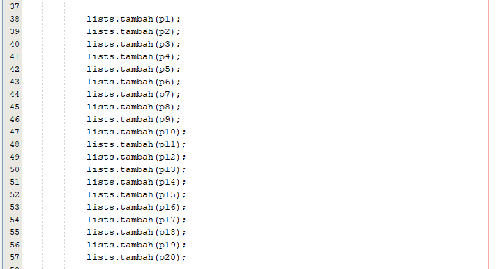
    * 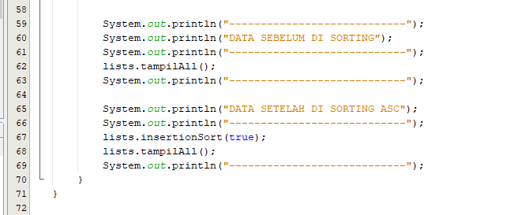
   Output
    * 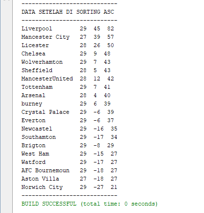
    * 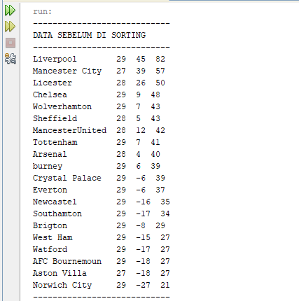