# Laporan Pertemuan 7 Searching

## 6.2.3 Pertanyaan
1. Perbedaan method TampilData(){} dan TampilPosisi(){} adalah pada method TampilData() untuk menampilkan data yang telah di temukan sedangkan method TampilPosisi() adalah untuk menampilkan posisi data yang ditemukan(indeks) 
2. Fungsi <i>break</i> pada program tersebut adalah akan menghentikan perulangan jika data telah ditemukan atau kondisi bernilai TRUE
3. Dapat Berjalan. Benar. Karena data tidak perlu di urutkan juga bisa berjalan(RUnning) maka program akan mencari data yang di cari walaupun tidak terurut.

## 6.3.3 Pertanyaan
1. Kode Program
    
2. Kode Program
    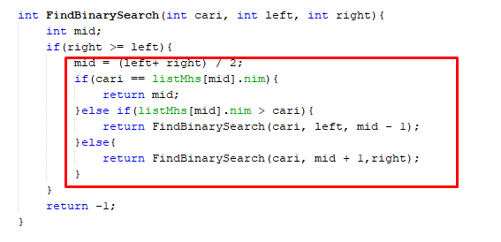
3. Berjalan tapi nim yang di cari tidak ditemukan. Karena binary search di asumsikan diurutkan terlebih dahulu
4. Tidak sesuai, karena tidak ditemukan.
    - 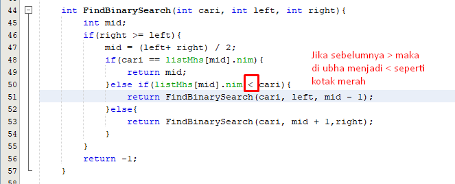
    - 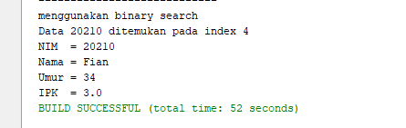
5. Kode program
    - 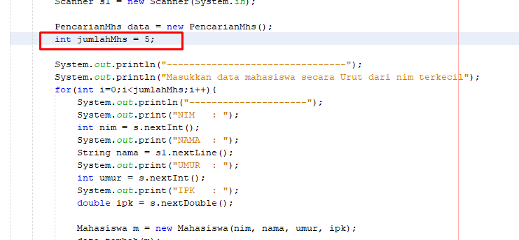

## Praktikum (Soal)
1. Code
    * 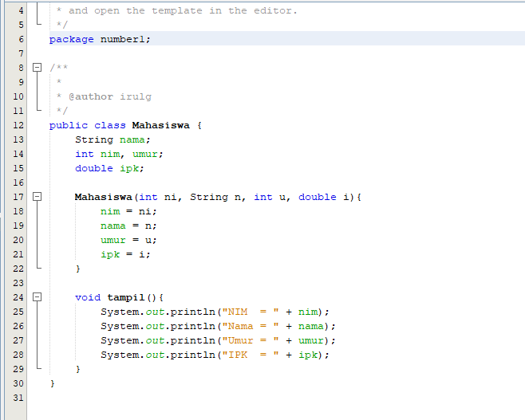
    * 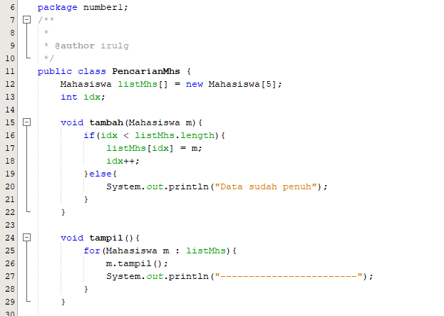
    * 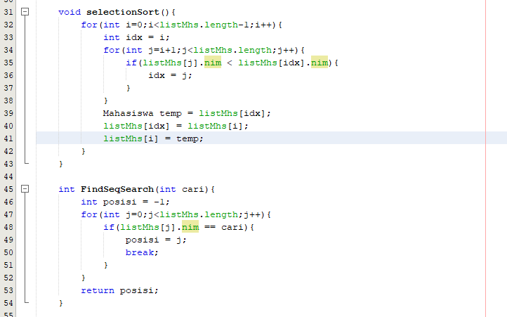
    * 
    * 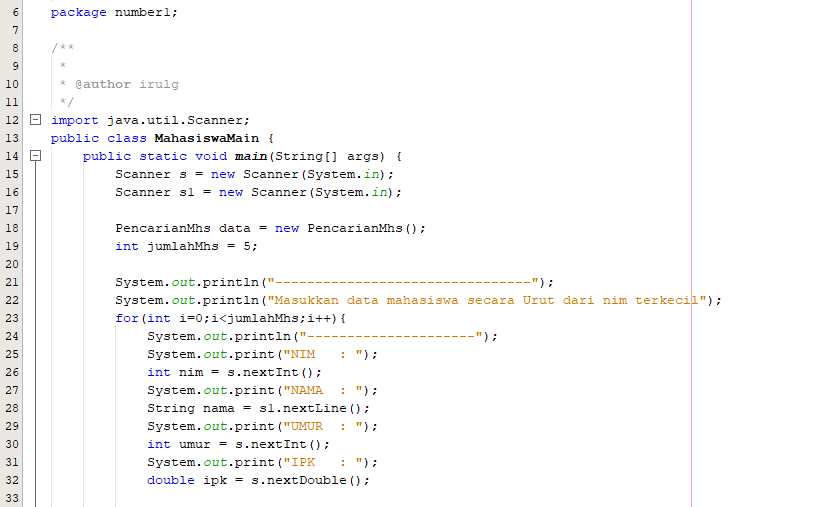
    * 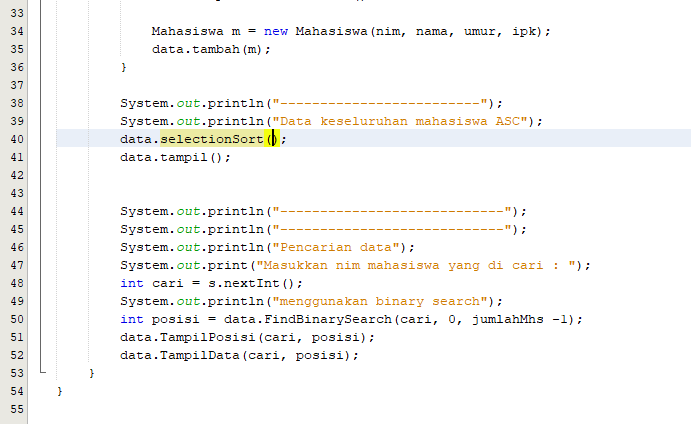
   Output
    * 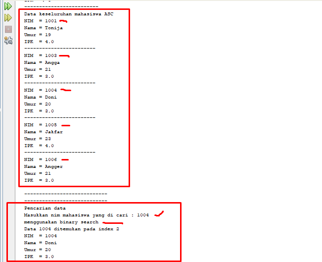
2. Code
    * 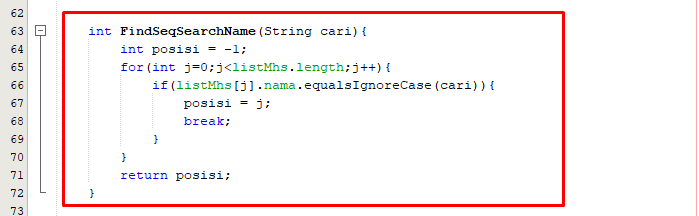
    * 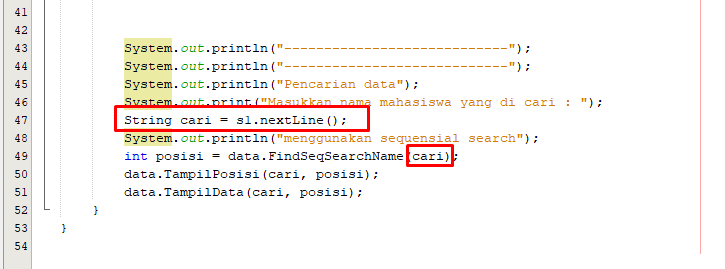
   Output
    * 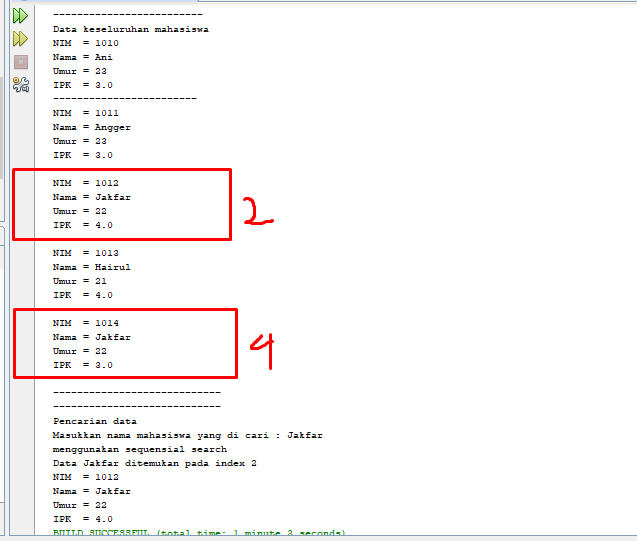
3. Code
    * 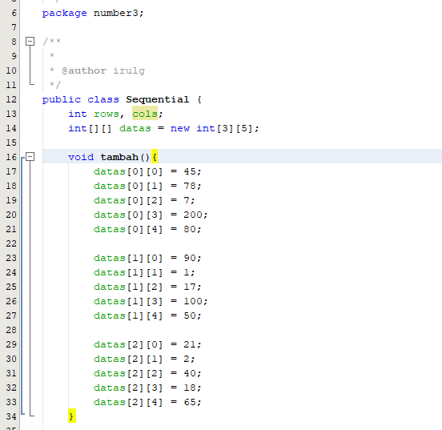
    * 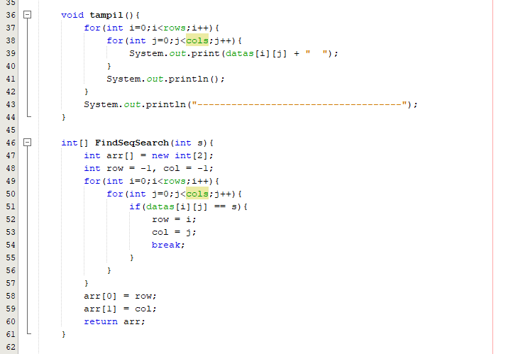
    * 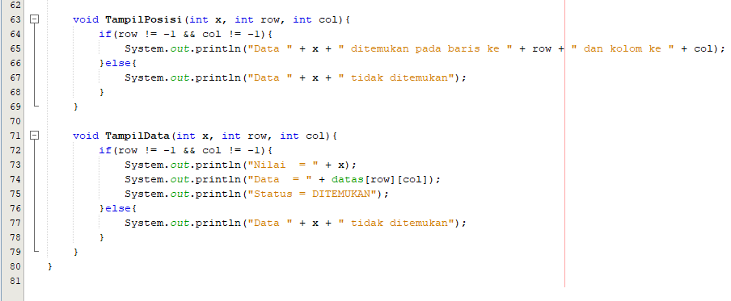
   Output
    * 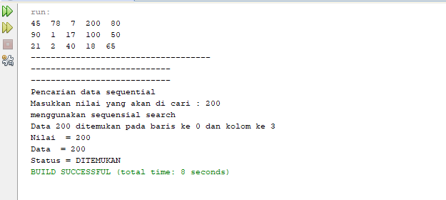
4. Code
    * 
    * 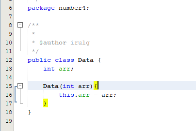
    * 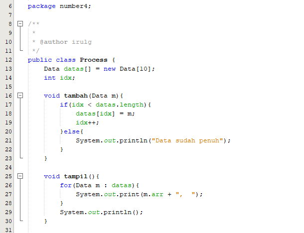
    * 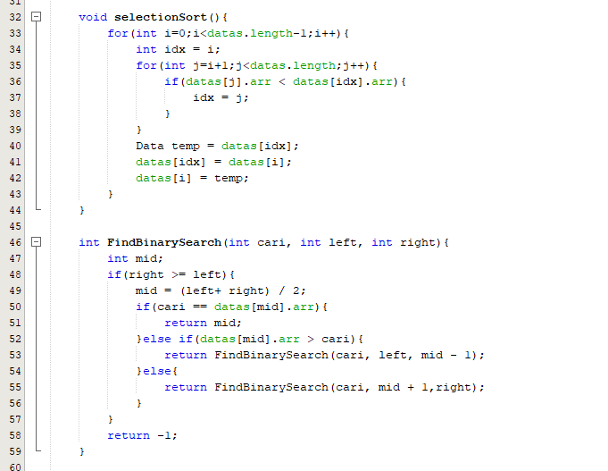
    * 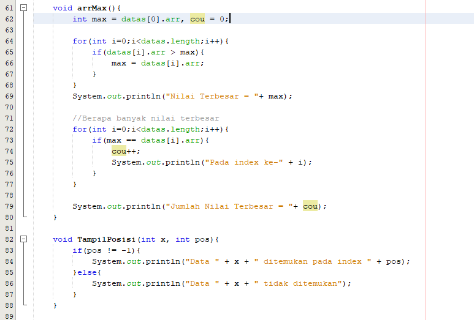
    * 
    * 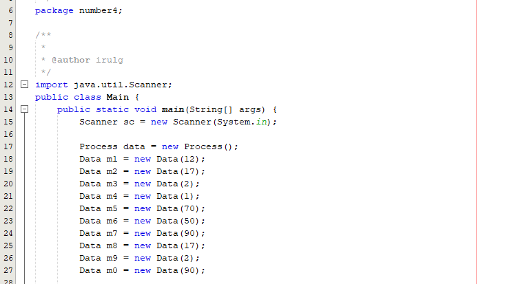
    * 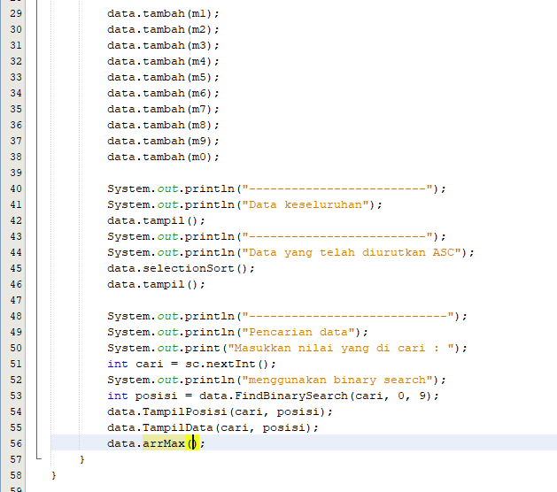
   Output
    * 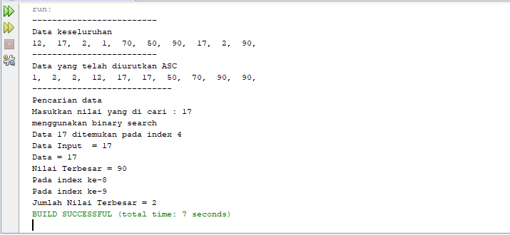
