# Laporan Pertemuan 9

## Pertanyaan 7.2.3
1. Fungsi angka 5 adalah untuk menginisialisasi size array pada class Stakc()
2. gambar
    - 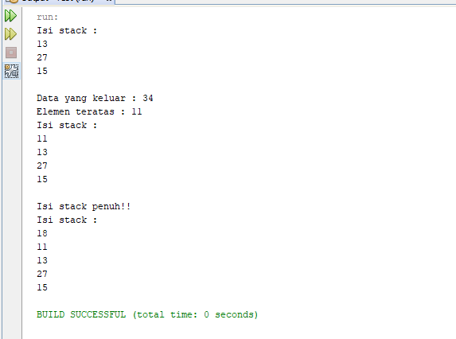
3. karena size array hanya 5 jadi angka 40 tidak di masukkan karena data stack sudah penuh

## Pertanyaan 7.3.3
1. Data dari instansiasi class Buku -> (judul, nama, tahun, jml, hrg)
2. Screenshot
    - 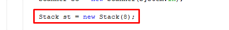
3. fungsi dari do-while pada StackMain adalah untuk looping isi data dari buku, jika ingin menambahkan tekan [Y/y] atau [N/n] jika tidak
4. Screenshot
    - 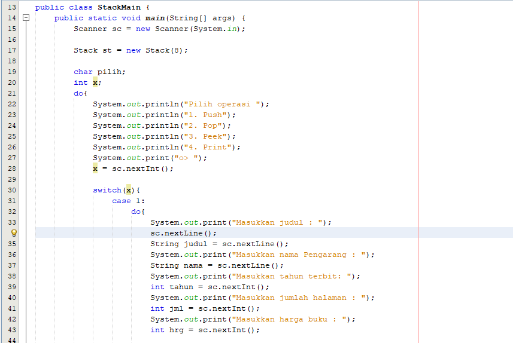
    - 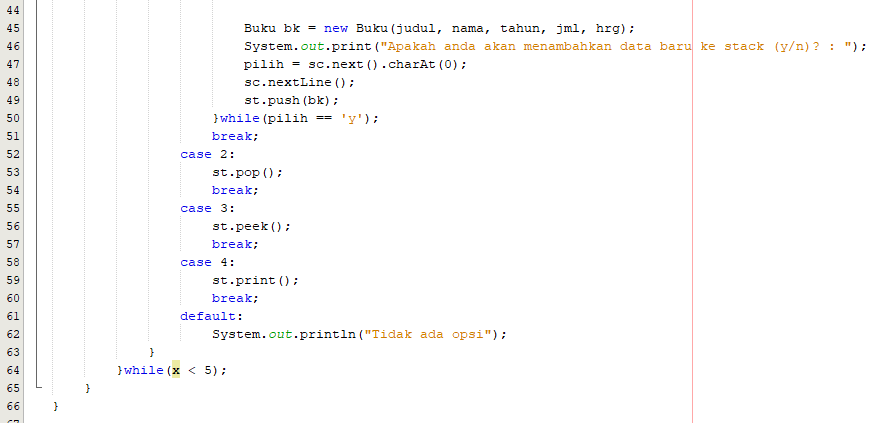

## Pertanyaan 7.4.3
1. Screenshot
    - 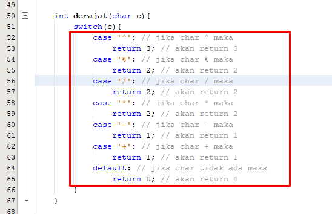
2. fungsi dari c = Q.charAt(i) adalah setiap huruf/karakter akan di looping dan dicek di char bagian ke berapa -> misal (Makan) -> char ke 1 adalah (a), variable i adalah sebagai memeriksa setiap karakter/huruf
3. Screenshot
    - 
4. karena digunakan untuk memastikan semua simbol/karakter yang masih berada
di stack setelah semua persamaan terbaca, akan dikeluarkan dan dipindahkan ke postfix

## 7.5 TUGAS
1. Code
    * 
    * 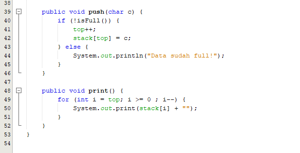
    * 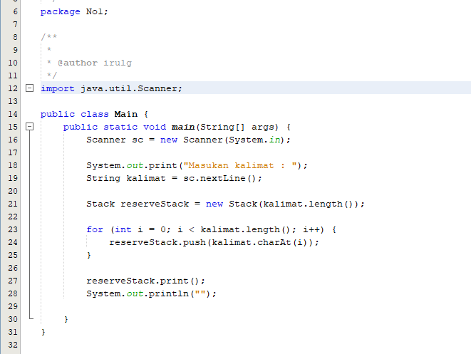
   Output
    * 
2. Code
    * 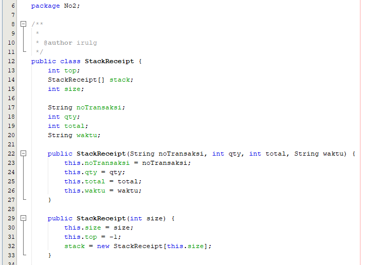
    * 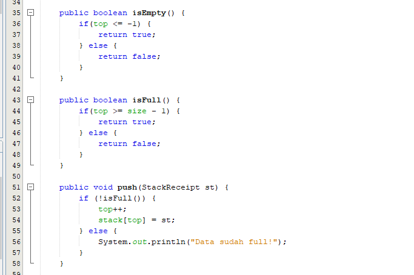
    * 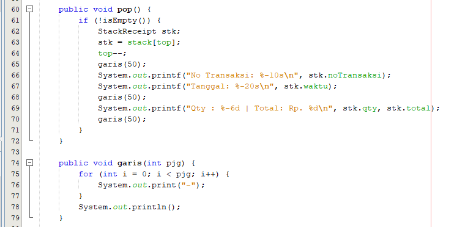
    * 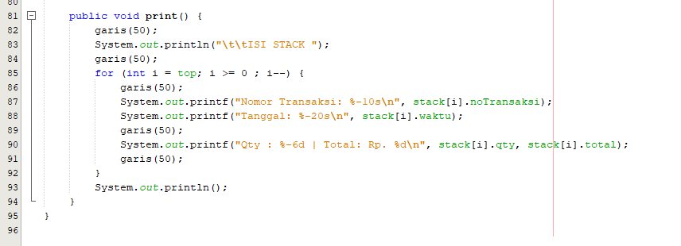
    * 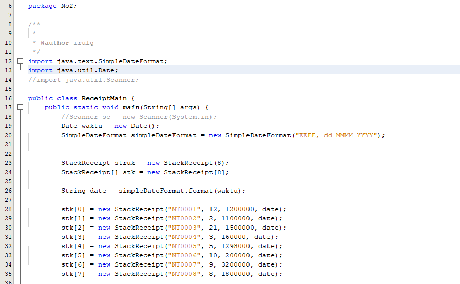
    * 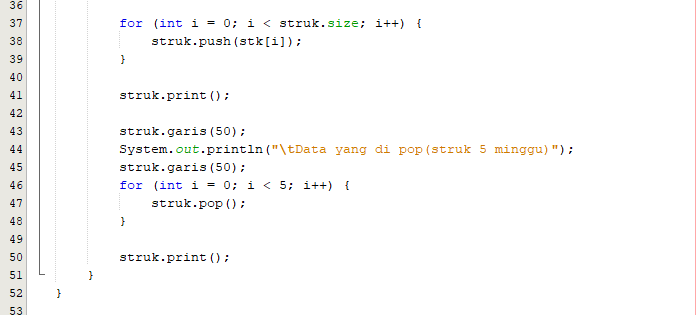
   Output
    * 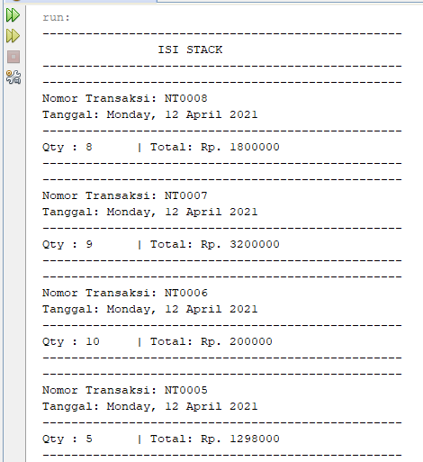
    * 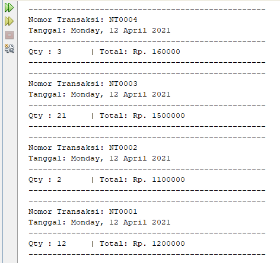
    * 
    * 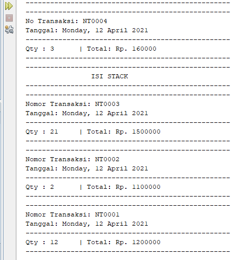